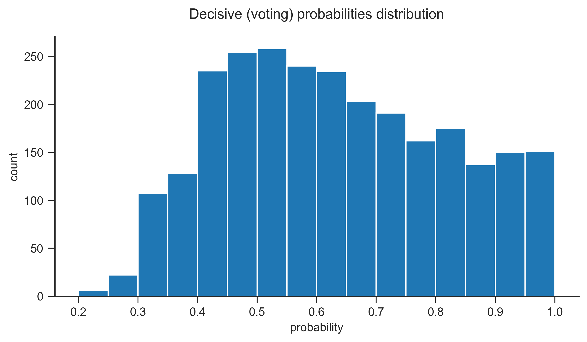
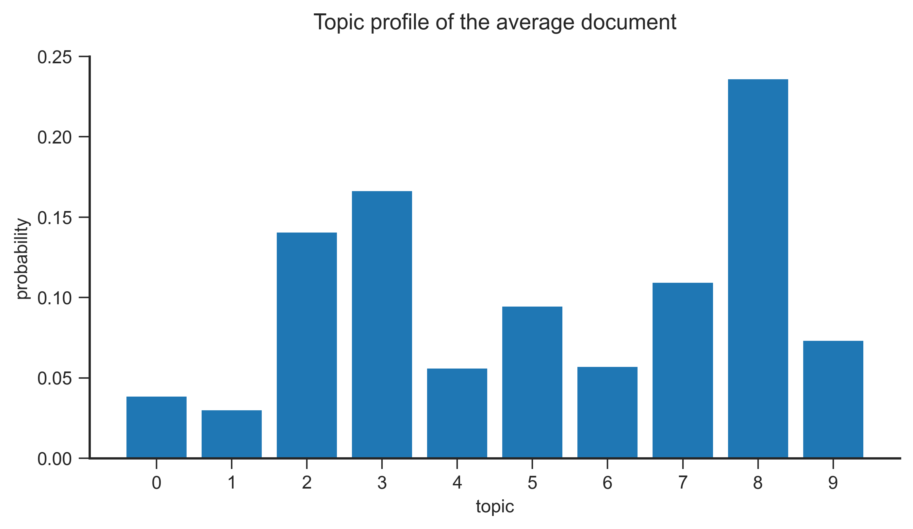
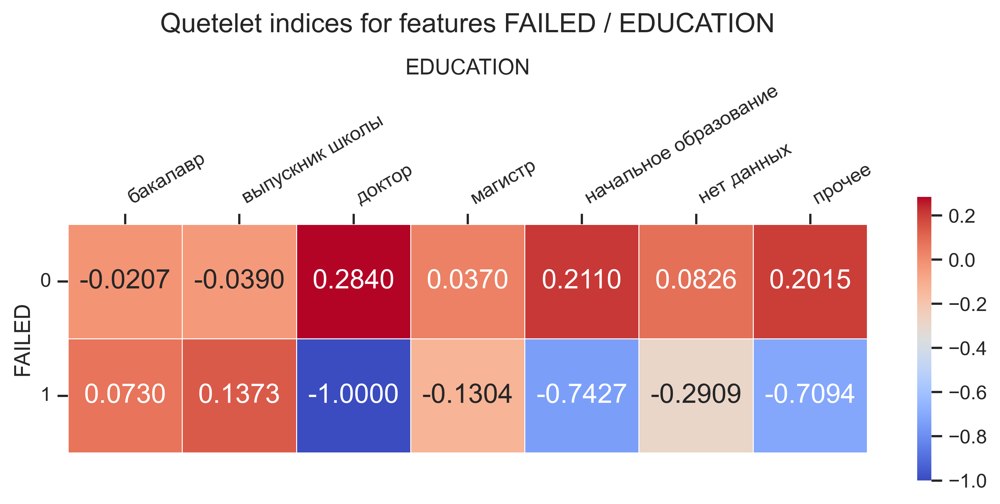
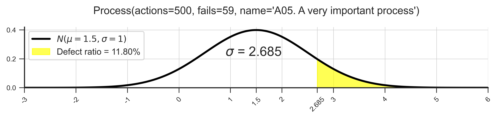
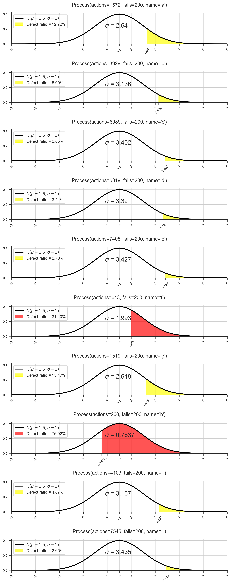

# <a id='toc1_'></a>[__sberpunk 0.1__](#toc0_)

**Установка**

Перейти в корневую папку с `setup.py`. Работа `DirectoryScanner` требует экстракторов текста из файлов различных форматов, поэтому установка тяжелых зависимостей для него организована как _extra_. Если `DirectoryScanner` использоваться не будет:
```
pip install .
```
Если `DirectoryScanner` использоваться будет, в дополнение к команде выше:
```
pip install .[directory_scanner]
```

Установка с github:
```
pip install git+https://github.com/EvgenyMeredelin/sberpunk.git
pip install "sberpunk[directory_scanner] @ git+https://github.com/EvgenyMeredelin/sberpunk.git"
```

**Содержание**<a id='toc0_'></a>
- [__sberpunk 0.1__](#toc1_)
  - [__Пример работы класса `DirectoryScanner`__](#toc1_1_)
    - [__Постановка задачи__](#toc1_1_1_)
    - [__Источники текстов__](#toc1_1_2_)
    - [__Соответствие между расширением файла и обработчиком__](#toc1_1_3_)
    - [__Назначение и параметризация обработчика__](#toc1_1_4_)
    - [__Инициализация объекта класса `DirectoryScanner`__](#toc1_1_5_)
    - [__Отчет писателя `HtmlReporter`__](#toc1_1_6_)
    - [__Публичный интерфейс класса `DirectoryScanner`__](#toc1_1_7_)
    - [__Создание своего обработчика__](#toc1_1_8_)
      - [__Обработчик извлекает из файла текст и возвращает его__](#toc1_1_8_1_)
      - [__Обработчик распаковывает файл в новую папку и возвращает путь к ней__](#toc1_1_8_2_)
    - [__Стратегия резки текста__](#toc1_1_9_)
    - [__Писатель отчета__](#toc1_1_10_)
  - [__Пример работы класса `LDATopicModeler`__](#toc1_2_)
    - [__Как это работает__](#toc1_2_1_)
    - [__Энтропия Шеннона__](#toc1_2_2_)
    - [__Источник текстов__](#toc1_2_3_)
    - [__Инициализация объекта класса `LDATopicModeler`__](#toc1_2_4_)
    - [__Результаты тематического моделирования__](#toc1_2_5_)
  - [__Пример работы класса `Rag`__](#toc1_3_)
    - [__Постановка задачи__](#toc1_3_1_)
    - [__Источники текстов__](#toc1_3_2_)
    - [__Инициализация объекта класса `Rag`__](#toc1_3_3_)
    - [__Поиск наиболее близких чанков__](#toc1_3_4_)
  - [__Пример работы класса `QueteletIndex`__](#toc1_4_)
    - [__Постановка задачи__](#toc1_4_1_)
    - [__Инициализация объекта класса `QueteletIndex`__](#toc1_4_2_)
    - [__Как это работает__](#toc1_4_3_)
    - [__Выводы__](#toc1_4_4_)
  - [__Пример работы с классом `Process`__](#toc1_5_)
    - [__Постановка задачи__](#toc1_5_1_)
    - [__Инициализация объекта класса `Process`__](#toc1_5_2_)
    - [__Работа с одиночным процессом__](#toc1_5_3_)
    - [__Работа с произвольным количеством процессов__](#toc1_5_4_)
    - [__Практический смысл__](#toc1_5_5_)

<!-- vscode-jupyter-toc-config
	numbering=false
	anchor=true
	flat=false
	minLevel=1
	maxLevel=6
	/vscode-jupyter-toc-config -->
<!-- THIS CELL WILL BE REPLACED ON TOC UPDATE. DO NOT WRITE YOUR TEXT IN THIS CELL -->

***
## <a id='toc1_1_'></a>[__Пример работы класса `DirectoryScanner`__](#toc0_)

***
### <a id='toc1_1_1_'></a>[__Постановка задачи__](#toc0_)

* Дано дерево папок произвольной вложенности. Папки содержат файлы различных расширений (документы, таблицы, изображения, архивы, почтовые сообщения и т.д.). Имея заданные ключевые слова и/или регулярные выражения, найти и свести в отчет фрагменты текстов из файлов, которые содержат искомую информацию.

* Решить задачу в соответствии с _принципом открытости/закрытости_: готовый код должен быть закрыт для модификации, но открыт для расширения. Предоставить пользователю возможность создавать свои обработчики файлов, параметризировать их и назначать на работу с расширениями по выбору.

***
### <a id='toc1_1_2_'></a>[__Источники текстов__](#toc0_)

В одной папке с ноутбуком находится архив `demo files.7z` с 6 файлами, содержащими тексты на русском языке:


```python
"""
sberpunk/examples/DirectoryScanner/demo files.7z/
├─not a docx file.docx
├─Ленинград - БСЭ.docx
├─Летний отдых россиян 1.png
├─Летний отдых россиян 2.jpeg
├─Трудовой договор.pdf
└─Туризм в России.xlsx
"""
```

***
### <a id='toc1_1_3_'></a>[__Соответствие между расширением файла и обработчиком__](#toc0_)

Поддерживаемые расширения файлов и соответствующие имена классов обработчиков, назначенных на то или иное расширение, находятся в атрибуте класса `DirectoryScanner.map`:


```python
from sberpunk.text.directory_scanner import *

# __all__ = [
#     'DirectoryScanner',
#     'ImgTesseractHandler',
#     'HandlerBaseClass',
#     'BatchingStrategyBaseClass',
#     'ReporterBaseClass'
# ]
```


```python
DirectoryScanner.map
```


    {
        "7z": "ArchiveHandler",
        "csv": "AnyTextFileHandler",
        "doc": "DocxHandler",
        "docx": "DocxHandler",
        "jpg": "ImgTesseractHandler",
        "json": "AnyTextFileHandler",
        "msg": "MsgHandler",
        "pdf": "PdfHandler",
        "png": "ImgTesseractHandler",
        "pptx": "PptxHandler",
        "py": "AnyTextFileHandler",
        "rtf": "RtfHandler",
        "txt": "AnyTextFileHandler",
        "xls": "XlsHandler",
        "xlsx": "XlsxHandler",
        "zip": "ZipHandler",
    }


Файлы с расширениями, не зарегистрированными в `DirectoryScanner.map`, сканером игнорируются.

***
### <a id='toc1_1_4_'></a>[__Назначение и параметризация обработчика__](#toc0_)

Из `DirectoryScanner.map` видно, что за работу с изображениями, расширения `png` и `jpg`, отвечает обработчик `ImgTesseractHandler`. Однако в примере есть файл с расширением `jpeg`. Обработчик на расширение назначается (или _расширение регистрируется_) методом класса `DirectoryScanner.update_map`:


```python
DirectoryScanner.update_map({'jpeg': ImgTesseractHandler})
DirectoryScanner.map
```


    {
        "7z": "ArchiveHandler",
        "csv": "AnyTextFileHandler",
        "doc": "DocxHandler",
        "docx": "DocxHandler",
        "jpeg": "ImgTesseractHandler",
        "jpg": "ImgTesseractHandler",
        "json": "AnyTextFileHandler",
        "msg": "MsgHandler",
        "pdf": "PdfHandler",
        "png": "ImgTesseractHandler",
        "pptx": "PptxHandler",
        "py": "AnyTextFileHandler",
        "rtf": "RtfHandler",
        "txt": "AnyTextFileHandler",
        "xls": "XlsHandler",
        "xlsx": "XlsxHandler",
        "zip": "ZipHandler",
    }


`ImgTesseractHandler` необходимо параметризировать:
* указать путь к `tesseract.exe` на своей машине;
* указать язык распознавания текста


```python
handler_kwargs = {
    ImgTesseractHandler: {
        # заменить на путь на своей машине
        'tesseract_cmd': 'C:/Program Files/Tesseract-OCR/tesseract.exe',
        # установку языков, отличных от английского, см. по ссылке ниже
        'tesseract_lang': 'rus'
    }
}
```

* [__Installing additional language packs__](https://ocrmypdf.readthedocs.io/en/latest/languages.html#installing-additional-language-packs)
* [__Python-tesseract is a python wrapper for Google's Tesseract-OCR__](https://pypi.org/project/pytesseract/)

***
### <a id='toc1_1_5_'></a>[__Инициализация объекта класса `DirectoryScanner`__](#toc0_)

Параметры:

* `keywords` — ключевые слова и/или регулярные выражения для поиска в текстах. Список строк `list[str]`.

(далее только именованные аргументы)

* `source` — локация файлов-источников. Папка с файлами или одиночный файл (например, архив с файлами). По умолчанию текущая рабочая папка. `str | pathlib.Path`.

* `report_dir` — папка для записи отчета. По умолчанию текущая рабочая папка. `str | pathlib.Path`.

* `ignore_extensions` — расширения файлов, пропускаемых обработкой даже если расширение зарегистрировано в `DirectoryScanner.map`. Множество строк `set[str]`.

* `batching_strategy` — стратегия резки текста на батчи. В данный момент реализована единственная стратегия, `LinewiseBatchingStrategy`, потомок абстрактного класса `BatchingStrategyBaseClass`. Объект `LinewiseBatchingStrategy` является значением по умолчанию данного аргумента. Реализацию `LinewiseBatchingStrategy` и как написать свою стратегию, см. в [__Стратегия резки текста__](#toc1_1_9_).

* `handler_kwargs` — именованные аргументы для параметризации соответствующих обработчиков. Структура по образцу одноименного словаря `handler_kwargs` из [__Назначение и параметризация обработчика__](#toc1_1_4_).

* `reporter` — писатель отчета. В данный момент реализован единственный писатель, `HtmlReporter`, потомок абстрактного класса `ReporterBaseClass`. Объект `HtmlReporter` является значением по умолчанию данного аргумента. Как сделать свой писатель, см. в [__Писатель отчета__](#toc1_1_10_).

Мы готовы инициализировать сканер. Будем искать в файлах фрагменты текста, содержащие заданные ниже 3 слова со всеми возможными продолжениями (суффиксы, окончания — вплоть до и не включая следующий за словом пробел):


```python
scanner = DirectoryScanner(
    keywords=[word + r'\w*' for word in ('график', 'отдых', 'ущерб')],
    source='demo files.7z',
    handler_kwargs=handler_kwargs
)
```

    INFO patool: Extracting \\?\D:\git\sberpunk\src\sberpunk\examples\DirectoryScanner\demo files.7z ...
    INFO patool: running "C:\Program Files\7-Zip\7z.EXE" x "-o\\?\D:\git\sberpunk\src\sberpunk\examples\DirectoryScanner\demo files" -- "\\?\D:\git\sberpunk\src\sberpunk\examples\DirectoryScanner\demo files.7z"
    INFO patool:     with input=
    INFO patool: ... \\?\D:\git\sberpunk\src\sberpunk\examples\DirectoryScanner\demo files.7z extracted to `\\?\D:\git\sberpunk\src\sberpunk\examples\DirectoryScanner\demo files'.


Здесь мы видим:
* Отчет `patool` о распаковке архива `demo files.7z`;
* Уведомление пользователя о том, что файл `not a docx file.docx` фактически не является архивом. И это действительно так. Это переименованный текстовый файл, добавленный в пример для демонстрации. Вспомним, что файлы `docx` и `xlsx` являются архивами.

***
### <a id='toc1_1_6_'></a>[__Отчет писателя `HtmlReporter`__](#toc0_)

Рассмотрим получившийся отчет. Здесь он для наглядности представлен средствами `IPython`. В реальной практике удобнее, конечно, просто открыть отчет в браузере.

* Клик на ссылке в оглавлении _Table of Contents_ переведет в начало соответствующего результата поиска в _Search Results_. Запись в оглавлении (и, соответственно, в результатах) тем выше, чем больше релевантных фрагментов текста было обнаружено в данном документе.

* В таблице мы видим найденные ключевые слова и соответствующий нумерованный фрагмент текста, например, `[__batch_id='00003'__]`. Если контекста, который задает фрагмент, читателю недостаточно (либо представление текста в ячейке таблицы не удобно для чтения), клик на результате поиска откроет разрезанную на фрагменты полную текстовую версию соответствующего документа — например, ее можно открыть в новой вкладке браузера.

* По какому правилу стратегия разрезает текст на батчи токенов, из которых (пере)собираются фрагменты текста, см. в [__Стратегия резки текста__](#toc1_1_9_).


```python
from IPython.display import display_html

with open('demo report.html', encoding='utf-8') as f:
    report = f.read()

display_html(report, raw=True)
```


<!DOCTYPE html>
<html>
<head>
<meta charset="utf-8">
<title>DirectoryScanner 2024-09-15 20-04-06</title>
<style>
body {
    font-family: "Segoe UI";
    background-color: #2e3440;
    color: #c9cfda;
    overflow-x: hidden;
}
a:link {
    color: #a3be8c;
}
a:visited {
    color: #b48ead;
}
table {
    border-collapse: collapse;
    width: 100%;
}
th.keywords {
    width: 15%
}
</style>
</head>
<body>
<h1>DirectoryScanner 2024-09-15 20-04-06</h1>
<hr>
<h2>Table of Contents</h2>
<ol type="1">
<li id="toc1"><a href="#1">D:\git\sberpunk\src\sberpunk\examples\DirectoryScanner\demo files\Трудовой договор.pdf.txt</a></li>
<li id="toc2"><a href="#2">D:\git\sberpunk\src\sberpunk\examples\DirectoryScanner\demo files\Ленинград - БСЭ.docx.txt</a></li>
<li id="toc3"><a href="#3">D:\git\sberpunk\src\sberpunk\examples\DirectoryScanner\demo files\Летний отдых россиян 2.jpeg.txt</a></li>
<li id="toc4"><a href="#4">D:\git\sberpunk\src\sberpunk\examples\DirectoryScanner\demo files\Летний отдых россиян 1.png.txt</a></li>
<li id="toc5"><a href="#5">D:\git\sberpunk\src\sberpunk\examples\DirectoryScanner\demo files\Туризм в России.xlsx.txt</a></li>
</ol>
<hr>
<h2>Search Results</h2>
<ol type="1">
<li id="1"><a href="file:///D:\git\sberpunk\src\sberpunk\examples\DirectoryScanner\demo files\Трудовой договор.pdf.txt">D:\git\sberpunk\src\sberpunk\examples\DirectoryScanner\demo files\Трудовой договор.pdf.txt</a></li><p>
<table border="1" class="dataframe">
  <thead>
    <tr style="text-align: left;">
      <th class="keywords">keywords</th>
      <th class="batch">batch</th>
    </tr>
  </thead>
  <tbody>
    <tr>
      <td>[отдых, отдыха]</td>
      <td>[__batch_id='00003'__]\n2.1.4.   Обеспечение   рабочего   места   оборудованием,   инструментами,   технической \nдокументацией   и   иными   средствами,   необходимыми   для   исполнения   им   трудовых \nобязанностей.\n2.1.5. Своевременную и в полном объеме выплату заработной платы в соответствии со \nсвоей квалификацией, сложностью труда, количеством и качеством выполненной работы.\n2.1.6. Отдых, то есть соблюдение ежедневной продолжительности рабочего времени, \nпредоставление   перерывов   для   отдыха   и   питания,   еженедельных   выходных   дней, \nоплачиваемых ежегодных отпусков в соответствии с настоящим трудовым договором и \nтрудовым законодательством РФ.\n2.1.7.   Обязательное   государственное   социальное   страхование   в   порядке   и   на \nусловиях,   установленных   действующим   законодательством   РФ,   на   период   действия \nнастоящего трудового договора.\n2.1.8. Осуществление иных прав, предусмотренных трудовым законодательством РФ, \nПравилами   внутреннего   трудового   распорядка   и   иными   локальными   нормативными \nактами.\n2.2. Работник обязан:\n2.2.1.   Добросовестно   исполнять   трудовую   функцию,   соответствующую   должности \nменеджера   по   персоналу,   закрепленную   в   должностной   инструкции   (Приложение   N   1),</td>
    </tr>
    <tr>
      <td>[ущерба]</td>
      <td>[__batch_id='00005'__]\n2.2.6.   Бережно   относиться   к   имуществу   Работодателя   (в   том   числе   к   имуществу \nтретьих лиц, находящемуся у работодателя, если работодатель несет ответственность за \nсохранность этого имущества) и других работников и при необходимости принимать меры \nдля предотвращения ущерба имуществу.\n2.3.   Не   включение   в   трудовой   договор   каких-либо   из   прав   и   (или)   обязанностей \nработника,   установленных   трудовым   законодательством   и   иными   нормативными \nправовыми   актами,   содержащими   нормы   трудового   права,   локальными   нормативными \nактами, не может рассматриваться как отказ от реализации этих прав или исполнения этих \nобязанностей.\n3. Права и обязанности Работодателя\n3.1. Работодатель имеет право:\n3.1.1. Изменять и расторгать трудовой договор с Работником в порядке и на условиях, \nкоторые установлены Трудовым кодексом РФ, иными федеральными законами.\n3.1.2.  Требовать  от  Работника  исполнения   им  трудовых  обязанностей  и  бережного \nотношения   к   имуществу   Работодателя   и   других   работников,   соблюдения   Правил \nвнутреннего   трудового   распорядка   и   иных   локальных   нормативных   актов,   трудовой \nдисциплины,\n  производственной   санитарии   и \nпротивопожарной защиты.</td>
    </tr>
    <tr>
      <td>[отдыха]</td>
      <td>[__batch_id='00008'__]\n3.2.9. Возмещать вред, причиненный Работнику в связи с исполнением им трудовых \nобязанностей, а также компенсировать моральный вред в порядке и на условиях, которые \nустановлены   Трудовым  кодексом  РФ,   другими   федеральными   законами   и   иными \nнормативными правовыми актами РФ.\n3.2.10.   Вести   на   Работника   трудовую   книжку   в   соответствии   с   законодательством \nРоссийской Федерации.\n3.2.11. Исполнять иные обязанности, предусмотренные трудовым законодательством, \nв   том   числе   законодательством   о   специальной   оценке   условий   труда,   и   иными \nнормативными правовыми актами, содержащими нормы трудового права, соглашениями, \nлокальными нормативными актами и настоящим трудовым договором.\n4. Рабочее время и время отдыха\n4.1. Работнику устанавливается нормальная продолжительность рабочего времени - \n40 часов в неделю.\n4.2. Работнику устанавливается следующий режим рабочего времени:\n- пятидневная рабочая неделя с двумя выходными днями (суббота и воскресенье);\n- продолжительность ежедневной работы - 8 часов;\n- начало работы - 09.00, окончание работы - 18.00;\n- перерыв для отдыха и питания - 1 час (с 13.00 до 14.00).</td>
    </tr>
    <tr>
      <td>[графике, графиком]</td>
      <td>[__batch_id='00009'__]\n4.2.1. Работодатель вправе привлекать Работника к работе в выходные и нерабочие \nпраздничные дни, а также к сверхурочной работе в порядке и на условиях, установленных \nтрудовым законодательством.\n4.3.\n  Работнику   предоставляется  \nежегодный   оплачиваемый   отпуск \nпродолжительностью 28 календарных дней.\n4.3.1. Право на использование отпуска за первый год работы возникает у Работника \nпо истечении шести месяцев непрерывной работы у данного Работодателя. По соглашению \nСторон, а также в установленных законом случаях оплачиваемый отпуск Работнику может \nбыть предоставлен и до истечения шести месяцев.\n4.3.2.   Отпуск   за   второй   и   последующие   годы   работы   может   предоставляться \nРаботнику в любое время рабочего года в соответствии с графиком отпусков.\n4.3.3.   При   желании   Работника   использовать   ежегодный   оплачиваемый   отпуск   в \nотличный от предусмотренного в графике отпусков период, он обязан предупредить об \nэтом Работодателя в письменном виде не позднее чем за 2 недели до предполагаемого \nотпуска.   Изменение   сроков   предоставления   отпуска   в   этом   случае   производится   по \nсоглашению Сторон.\n4.3.4.   По   соглашению   Сторон   ежегодный   оплачиваемый   отпуск   может</td>
    </tr>
    <tr>
      <td>[ущерб, ущерба]</td>
      <td>[__batch_id='00012'__]\n- причинения ущерба имуществу Работника;\n- задержки выплаты Работнику заработной платы;\n- причинения Работнику морального вреда;\n- других случаях, предусмотренных законодательством РФ.\n6.3.2. Работник несет материальную ответственность как за прямой действительный \nущерб,   непосредственно   причиненный   им   Работодателю,   так   и   за   ущерб,   возникший   у \nРаботодателя в результате возмещения им ущерба третьим лицам.\n7. Изменение и прекращение трудового договора\n7.1.   Изменение   определенных   сторонами   условий   трудового   договора   допускается \nтолько   по   соглашению   Сторон,   которое   оформляется   дополнительным   соглашением, \nявляющимся неотъемлемой частью настоящего трудового договора.\n7.1.1. Изменения и дополнения в условия настоящего трудового договора могут быть \nвнесены   по   соглашению   Сторон   при   изменении   законодательства   РФ,   коллективного \nдоговора,   локальных   нормативных   актов   Работодателя,   а   также   в   других   случаях, \nпредусмотренных Трудовым кодексом РФ.\n7.2.   Настоящий   трудовой   договор   может   быть   прекращен   только   по   основаниям, \nпредусмотренным Трудовым кодексом РФ и иными федеральными законами.</td>
    </tr>
  </tbody>
</table></p><br>
<li id="2"><a href="file:///D:\git\sberpunk\src\sberpunk\examples\DirectoryScanner\demo files\Ленинград - БСЭ.docx.txt">D:\git\sberpunk\src\sberpunk\examples\DirectoryScanner\demo files\Ленинград - БСЭ.docx.txt</a></li><p>
<table border="1" class="dataframe">
  <thead>
    <tr style="text-align: left;">
      <th class="keywords">keywords</th>
      <th class="batch">batch</th>
    </tr>
  </thead>
  <tbody>
    <tr>
      <td>[график, графиков]</td>
      <td>[__batch_id='00031'__]\nВ развитии изобразительного искусства большое значение имела деятельность петербургской АХ (основана в 1757). Крупнейшими живописцами, работавшими в Петербурге в 18 в., были А. П. Лосенко, писавший картины на исторические темы, портретисты Д. Г. Левицкий, В. Л. Боровиковский, скульпторы Ф. И. Шубин, И. П. Мартос и др. В 19 в. работали портретисты О. А. Кипренский, К. П. Брюллов, основоположник критического реализма в изобразительном искусстве П. А. Федотов, один из создателей и идейный руководитель «передвижничества» И. Н. Крамской (см. Передвижники), график А. А. Лгин; с Петербургом связана большая часть творческой жизни И. Е. Репина. В конце 19 — начале 20 вв. создаются многочисленные художественные объединения, в том числе «Mиp искусства», крупнейшими представителями которого были живописцы А. Н. Бенуа, М. В. Добужинский, Б. М. Кустодиев, К. А. Сомов, Н. К. Рерих и др. В советское время с Л. связано творчество живописцев Н. И. Альтмана, И. И. Бродского, К. С. Петрова-Водкина, Вл. А. Серова, графиков А. П. Остроумовой-Лебедевой, В. В. Лебедева, А. Ф. Пахомова, скульпторов А. Т. Матвеева, В. В. Исаевой и др.</td>
    </tr>
    <tr>
      <td>[отдыха]</td>
      <td>[__batch_id='00042'__]\nВ окрестностях Л. расположен Ленинградский курортный район. Функционировали (к 1973) 35 санаториев (в 1913 — 9, в 1940 — 23) на 8 тыс. мест (в 1913 — 430 мест, в 1940 — 3,5 тыс.), из них 27 детских санаториев (в 1913 — 4, в 1940 — 15) на 4,5 тыс. мест (в 1913 — 120, в 1940 — 1,9 тыс.), 17 домов отдыха (в 1913 не было, в 1940 — 18) на 6 тыс. мест (в 1940 — 4,9 тыс. мест), 7 пансионатов. Работает также около 400 пионерских лагерей, лесных школ и др. детских оздоровительных учреждений.</td>
    </tr>
    <tr>
      <td>[ущерб]</td>
      <td>[__batch_id='00049'__]\nВ годы Великой Отечественной войны Л. был нанесён большой ущерб. Были повреждены выдающиеся памятники архитектуры (Адмиралтейство, Зимний дворец, Казанский собор, Академия художеств и др.). После войны все поврежденные здания и сооружения были восстановлены.</td>
    </tr>
  </tbody>
</table></p><br>
<li id="3"><a href="file:///D:\git\sberpunk\src\sberpunk\examples\DirectoryScanner\demo files\Летний отдых россиян 2.jpeg.txt">D:\git\sberpunk\src\sberpunk\examples\DirectoryScanner\demo files\Летний отдых россиян 2.jpeg.txt</a></li><p>
<table border="1" class="dataframe">
  <thead>
    <tr style="text-align: left;">
      <th class="keywords">keywords</th>
      <th class="batch">batch</th>
    </tr>
  </thead>
  <tbody>
    <tr>
      <td>[отдых, отдыха]</td>
      <td>[__batch_id='00001'__]\nЛетний отдых у жителей России ассоциируется прежде всего с выездом\nна море и природу.\nЧетверть россиян планируют провести отдых внутри своего региона —\nна дачах, рыбалке, охоте.\nБольшинство россиян считают оптимальным сроком для начала подготовки\nлетних отпускных поездок -- 1-2 месяца, однако более четверти (28%)\nпредпочитают планировать отпуск за 3-4 месяца.\nВаше мнение.\nСвои комментарии и идеи вы можете\nнаправлять нам по адресу степо\nв— ееа\n68 000 руб. - средний чек на туриста в рамках летней поездки.\nНеобходимо:\n* для развития туристического бизнеса регионов, не имеющих выхода к\nморю, создавать туристические предложения с учетом наиболее\nвостребованных форматов отдыха - рыбалка, охота, загородные бани,\nспортивные активности (сплавы, хайкинг, велотропы ит. д.);\n® формировать предложение с учетом планируемых трат (финансовых\nвозможностей) россиян на летний отдых;\n* следить за соотношением цены и качества предложений;\n* принимать во внимание возможности разных социальных категорий\nтуристов;\n. ФОРМИРОВЭТЬ специальные предложения для тех, кто начинает\nподготовку к летнему отпуску заранее;</td>
    </tr>
    <tr>
      <td>[отдыха]</td>
      <td>[__batch_id='00002'__]\nв ФОРМИРОВЭТЬ локальные предложения, отвечающие предпочтениям\nжителей региона относительно форматов отдыха.</td>
    </tr>
  </tbody>
</table></p><br>
<li id="4"><a href="file:///D:\git\sberpunk\src\sberpunk\examples\DirectoryScanner\demo files\Летний отдых россиян 1.png.txt">D:\git\sberpunk\src\sberpunk\examples\DirectoryScanner\demo files\Летний отдых россиян 1.png.txt</a></li><p>
<table border="1" class="dataframe">
  <thead>
    <tr style="text-align: left;">
      <th class="keywords">keywords</th>
      <th class="batch">batch</th>
    </tr>
  </thead>
  <tbody>
    <tr>
      <td>[отдыха]</td>
      <td>[__batch_id='00001'__]\nЛетний сезон - пик туристического отдыха среди россиян.\nДороговизна билетов или проживания - среди ключевых факторов,\nкоторые удерживают россиян от путешествий по стране летом.\nОтсутствие уверенности в том, что ожидания относительно качества\nсервиса и инфраструктуры места отдыха совпадут с реальностью —\nв ТОП-З3 причин, по которым наши соотечественники остаются дома\nлетом.\nТакже в числе распространенных барьеров - плохая транспортная\nдоступность мест для летнего отдыха в стране, неразвитость\nинфраструктуры и низкое качество сервиса.\nНеобходимо:\nповышать качество инфраструктуры и сервиса в туристических\nместах страны, подходящих для летнего отдыха;\nинформировать об этом в рекламных кампаниях мест отдыха;\nразвивать региональные транспортные сети, а также создавать\nточки для летнего отдыха в границах регионов;\nпоощрять туристов (в том числе блогеров и инфлюенсеров)\nоставлять отзывы о туристическом объекте для снижения\nстепени неопределенности среди туристов, которые еще не\nпосещали это место;\nвнедрять системы ФИНЭНСОВОЙ мотивации к путешествию —\nлетний кешбэк, расширение числа чартерных рейсов, скидки\nсемьям с детьми и др.</td>
    </tr>
  </tbody>
</table></p><br>
<li id="5"><a href="file:///D:\git\sberpunk\src\sberpunk\examples\DirectoryScanner\demo files\Туризм в России.xlsx.txt">D:\git\sberpunk\src\sberpunk\examples\DirectoryScanner\demo files\Туризм в России.xlsx.txt</a></li><p>
<table border="1" class="dataframe">
  <thead>
    <tr style="text-align: left;">
      <th class="keywords">keywords</th>
      <th class="batch">batch</th>
    </tr>
  </thead>
  <tbody>
    <tr>
      <td>[отдыхавших]</td>
      <td>[__batch_id='00001'__]\n[__Worksheet Санаторно-курортные организации__]\nЧисленность лиц, лечившихся и отдыхавших в санаторно-курортных организациях,\nпо возрастным группам\n                                                                                                                                                                                                                                                                                                                                                       тыс. человек\n                                                                                           2018                                          2019                                                    2020                                                     2021                                                     2022\n                                                                                           Всего     из них                              Всего             из них                                Всего             из них                                 Всего             из них                                 Всего             из них\n                                                                                                     лиц до 18 лет  лиц 55 лет и старше                    лиц до 18 лет    лиц 55 лет и старше                    лиц до 18 лет     лиц 55 лет и старше                    лиц до 18 лет     лиц 55 лет и старше                    лиц до 18 лет     лиц 55 лет и старше\nЧисленность обслуженных лиц в санаторно-курортных организациях - всего                     6879.835  1714.759       2147.538             7231.457          1758.229         2400.171             4479.469          932.051           1503.144             6654.212          1603.523          2168.325             7220.644          1867.78           2429.13\nв том числе:\nчисленность размещенных лиц                                                                6415.018  1593.19        1981.831             6704.444          1641.504         2208.138             4044.485          836.061           1336.458             5992.352          1451.765          1920.693             6561.834          1710.258          2195.929\nиз них:\nчисленность размещенных граждан России с ограниченными возможностями здоровья и инвалидов  …         …              …                    155.872           32.82            81.785               106.137           25.165            58.618               157.249           31.616            90.551               200.411           39.324            118.564</td>
    </tr>
  </tbody>
</table></p>
</ol>
</body>
</html>


***
### <a id='toc1_1_7_'></a>[__Публичный интерфейс класса `DirectoryScanner`__](#toc0_)


```python
from sberpunk import public_api
public_api(scanner)
```


    ['batching_strategy',
     'counter',
     'handler_kwargs',
     'ignore_extensions',
     'keywords',
     'map',
     'records',
     'report_dir',
     'reporter',
     'restore_map_defaults',
     'source',
     'unique_files_seen',
     'update_map']


Разберем оставшиеся публичные члены интерфейса.

* `unique_files_seen` — число уникальных файлов, встреченных сканером:


```python
# сам архив как файл + 6 файлов внутри него
scanner.unique_files_seen
```


    7


* `counter` — счетчик найденных ключевых слов по всем документам в порядке убывания числа вхождений:


```python
scanner.counter
```


    Counter({'отдыха': 6,
             'ущерб': 2,
             'отдых': 2,
             'ущерба': 2,
             'графиков': 1,
             'график': 1,
             'графиком': 1,
             'графике': 1,
             'отдыхавших': 1})


* `restore_map_defaults` — см. раздел [__Создание своего обработчика__](#toc1_1_8_).

* `records` — атрибут, в котором консолидируются все результаты поиска. Это словарь, в котором ключи — полные пути до текстовых версий документов, значения — списки объектов служебного класса `Record` с атрибутами `keywords` и `batch`. `batch` на самом деле строка. Список же строк, который мы видим ниже, — это лишь свертка `textwrap` для компактного удобочитаемого формального и неформального представлений.
<br>Выбор такой структуры обусловлен тем, что список словарей удобно трансформировать в датафрейм.
<br>`records` это тот объект, запись которого на диск обязан реализовать любой наследующийся от базового класса писатель отчета. Подробнее в [__Писатель отчета__](#toc1_1_10_).


```python
scanner.records
```


    {'D:\\git\\sberpunk\\src\\sberpunk\\examples\\DirectoryScanner\\demo files\\Трудовой договор.pdf.txt': [{
          "keywords": ["отдых", "отдыха"],
          "batch": [
              "[__batch_id='00003'__] 2.1.4.   Обеспечение   рабочего",
              "места   оборудованием,   инструментами,   технической",
              "документацией   и   иными   средствами,   необходимыми   для",
              "исполнения   им   трудовых  обязанностей. 2.1.5.",
              "Своевременную и в полном объеме выплату заработной платы в",
              "соответствии со  своей квалификацией, сложностью труда,",
              "количеством и качеством выполненной работы. 2.1.6. Отдых, то",
              "есть соблюдение ежедневной продолжительности рабочего",
              "времени,  предоставление   перерывов   для   отдыха   и",
              "питания,   еженедельных   выходных   дней,  оплачиваемых",
              "ежегодных отпусков в соответствии с настоящим трудовым",
              "договором и  трудовым законодательством РФ. 2.1.7.",
              "Обязательное   государственное   социальное   страхование",
              "в   порядке   и   на  условиях,   установленных",
              "действующим   законодательством   РФ,   на   период",
              "действия  настоящего трудового договора. 2.1.8.",
              "Осуществление иных прав, предусмотренных трудовым",
              "законодательством РФ,  Правилами   внутреннего   трудового",
              "распорядка   и   иными   локальными   нормативными  актами.",
              "2.2. Работник обязан: 2.2.1.   Добросовестно   исполнять",
              "трудовую   функцию,   соответствующую   должности  менеджера",
              "по   персоналу,   закрепленную   в   должностной",
              "инструкции   (Приложение   N   1),",
          ],
      },
      {
          "keywords": ["ущерба"],
          "batch": [
              "[__batch_id='00005'__] 2.2.6.   Бережно   относиться   к",
              "имуществу   Работодателя   (в   том   числе   к   имуществу",
              "третьих лиц, находящемуся у работодателя, если работодатель",
              "несет ответственность за  сохранность этого имущества) и",
              "других работников и при необходимости принимать меры  для",
              "предотвращения ущерба имуществу. 2.3.   Не   включение   в",
              "трудовой   договор   каких-либо   из   прав   и   (или)",
              "обязанностей  работника,   установленных   трудовым",
              "законодательством   и   иными   нормативными  правовыми",
              "актами,   содержащими   нормы   трудового   права,",
              "локальными   нормативными  актами, не может рассматриваться",
              "как отказ от реализации этих прав или исполнения этих",
              "обязанностей. 3. Права и обязанности Работодателя 3.1.",
              "Работодатель имеет право: 3.1.1. Изменять и расторгать",
              "трудовой договор с Работником в порядке и на условиях,",
              "которые установлены Трудовым кодексом РФ, иными федеральными",
              "законами. 3.1.2.  Требовать  от  Работника  исполнения   им",
              "трудовых  обязанностей  и  бережного  отношения   к",
              "имуществу   Работодателя   и   других   работников,",
              "соблюдения   Правил  внутреннего   трудового   распорядка",
              "и   иных   локальных   нормативных   актов,   трудовой",
              "дисциплины,   производственной   санитарии   и",
              "противопожарной защиты.",
          ],
      },
      {
          "keywords": ["отдыха"],
          "batch": [
              "[__batch_id='00008'__] 3.2.9. Возмещать вред, причиненный",
              "Работнику в связи с исполнением им трудовых  обязанностей, а",
              "также компенсировать моральный вред в порядке и на условиях,",
              "которые  установлены   Трудовым  кодексом  РФ,   другими",
              "федеральными   законами   и   иными  нормативными правовыми",
              "актами РФ. 3.2.10.   Вести   на   Работника   трудовую",
              "книжку   в   соответствии   с   законодательством",
              "Российской Федерации. 3.2.11. Исполнять иные обязанности,",
              "предусмотренные трудовым законодательством,  в   том   числе",
              "законодательством   о   специальной   оценке   условий",
              "труда,   и   иными  нормативными правовыми актами,",
              "содержащими нормы трудового права, соглашениями,  локальными",
              "нормативными актами и настоящим трудовым договором. 4.",
              "Рабочее время и время отдыха 4.1. Работнику устанавливается",
              "нормальная продолжительность рабочего времени -  40 часов в",
              "неделю. 4.2. Работнику устанавливается следующий режим",
              "рабочего времени: - пятидневная рабочая неделя с двумя",
              "выходными днями (суббота и воскресенье); - продолжительность",
              "ежедневной работы - 8 часов; - начало работы - 09.00,",
              "окончание работы - 18.00; - перерыв для отдыха и питания - 1",
              "час (с 13.00 до 14.00).",
          ],
      },
      {
          "keywords": ["графике", "графиком"],
          "batch": [
              "[__batch_id='00009'__] 4.2.1. Работодатель вправе привлекать",
              "Работника к работе в выходные и нерабочие  праздничные дни,",
              "а также к сверхурочной работе в порядке и на условиях,",
              "установленных  трудовым законодательством. 4.3.   Работнику",
              "предоставляется   ежегодный   оплачиваемый   отпуск",
              "продолжительностью 28 календарных дней. 4.3.1. Право на",
              "использование отпуска за первый год работы возникает у",
              "Работника  по истечении шести месяцев непрерывной работы у",
              "данного Работодателя. По соглашению  Сторон, а также в",
              "установленных законом случаях оплачиваемый отпуск Работнику",
              "может  быть предоставлен и до истечения шести месяцев.",
              "4.3.2.   Отпуск   за   второй   и   последующие   годы",
              "работы   может   предоставляться  Работнику в любое время",
              "рабочего года в соответствии с графиком отпусков. 4.3.3.",
              "При   желании   Работника   использовать   ежегодный",
              "оплачиваемый   отпуск   в  отличный от предусмотренного в",
              "графике отпусков период, он обязан предупредить об  этом",
              "Работодателя в письменном виде не позднее чем за 2 недели до",
              "предполагаемого  отпуска.   Изменение   сроков",
              "предоставления   отпуска   в   этом   случае   производится",
              "по  соглашению Сторон. 4.3.4.   По   соглашению   Сторон",
              "ежегодный   оплачиваемый   отпуск   может",
          ],
      },
      {
          "keywords": ["ущерб", "ущерба"],
          "batch": [
              "[__batch_id='00012'__] - причинения ущерба имуществу",
              "Работника; - задержки выплаты Работнику заработной платы; -",
              "причинения Работнику морального вреда; - других случаях,",
              "предусмотренных законодательством РФ. 6.3.2. Работник несет",
              "материальную ответственность как за прямой действительный",
              "ущерб,   непосредственно   причиненный   им   Работодателю,",
              "так   и   за   ущерб,   возникший   у  Работодателя в",
              "результате возмещения им ущерба третьим лицам. 7. Изменение",
              "и прекращение трудового договора 7.1.   Изменение",
              "определенных   сторонами   условий   трудового   договора",
              "допускается  только   по   соглашению   Сторон,   которое",
              "оформляется   дополнительным   соглашением,  являющимся",
              "неотъемлемой частью настоящего трудового договора. 7.1.1.",
              "Изменения и дополнения в условия настоящего трудового",
              "договора могут быть  внесены   по   соглашению   Сторон",
              "при   изменении   законодательства   РФ,   коллективного",
              "договора,   локальных   нормативных   актов   Работодателя,",
              "а   также   в   других   случаях,  предусмотренных Трудовым",
              "кодексом РФ. 7.2.   Настоящий   трудовой   договор   может",
              "быть   прекращен   только   по   основаниям,",
              "предусмотренным Трудовым кодексом РФ и иными федеральными",
              "законами.",
          ],
      }],
     'D:\\git\\sberpunk\\src\\sberpunk\\examples\\DirectoryScanner\\demo files\\Ленинград - БСЭ.docx.txt': [{
          "keywords": ["график", "графиков"],
          "batch": [
              "[__batch_id='00031'__] В развитии изобразительного искусства",
              "большое значение имела деятельность петербургской АХ",
              "(основана в 1757). Крупнейшими живописцами, работавшими в",
              "Петербурге в 18 в., были А. П. Лосенко, писавший картины на",
              "исторические темы, портретисты Д. Г. Левицкий, В. Л.",
              "Боровиковский, скульпторы Ф. И. Шубин, И. П. Мартос и др. В",
              "19 в. работали портретисты О. А. Кипренский, К. П. Брюллов,",
              "основоположник критического реализма в изобразительном",
              "искусстве П. А. Федотов, один из создателей и идейный",
              "руководитель «передвижничества» И. Н. Крамской (см.",
              "Передвижники), график А. А. Лгин; с Петербургом связана",
              "большая часть творческой жизни И. Е. Репина. В конце 19 —",
              "начале 20 вв. создаются многочисленные художественные",
              "объединения, в том числе «Mиp искусства», крупнейшими",
              "представителями которого были живописцы А. Н. Бенуа, М. В.",
              "Добужинский, Б. М. Кустодиев, К. А. Сомов, Н. К. Рерих и др.",
              "В советское время с Л. связано творчество живописцев Н. И.",
              "Альтмана, И. И. Бродского, К. С. Петрова-Водкина, Вл. А.",
              "Серова, графиков А. П. Остроумовой-Лебедевой, В. В.",
              "Лебедева, А. Ф. Пахомова, скульпторов А. Т. Матвеева, В. В.",
              "Исаевой и др.",
          ],
      },
      {
          "keywords": ["отдыха"],
          "batch": [
              "[__batch_id='00042'__] В окрестностях Л. расположен",
              "Ленинградский курортный район. Функционировали (к 1973) 35",
              "санаториев (в 1913 — 9, в 1940 — 23) на 8 тыс. мест (в 1913",
              "— 430 мест, в 1940 — 3,5 тыс.), из них 27 детских санаториев",
              "(в 1913 — 4, в 1940 — 15) на 4,5 тыс. мест (в 1913 — 120, в",
              "1940 — 1,9 тыс.), 17 домов отдыха (в 1913 не было, в 1940 —",
              "18) на 6 тыс. мест (в 1940 — 4,9 тыс. мест), 7 пансионатов.",
              "Работает также около 400 пионерских лагерей, лесных школ и",
              "др. детских оздоровительных учреждений.",
          ],
      },
      {
          "keywords": ["ущерб"],
          "batch": [
              "[__batch_id='00049'__] В годы Великой Отечественной войны Л.",
              "был нанесён большой ущерб. Были повреждены выдающиеся",
              "памятники архитектуры (Адмиралтейство, Зимний дворец,",
              "Казанский собор, Академия художеств и др.). После войны все",
              "поврежденные здания и сооружения были восстановлены.",
          ],
      }],
     'D:\\git\\sberpunk\\src\\sberpunk\\examples\\DirectoryScanner\\demo files\\Летний отдых россиян 2.jpeg.txt': [{
          "keywords": ["отдых", "отдыха"],
          "batch": [
              "[__batch_id='00001'__] Летний отдых у жителей России",
              "ассоциируется прежде всего с выездом на море и природу.",
              "Четверть россиян планируют провести отдых внутри своего",
              "региона — на дачах, рыбалке, охоте. Большинство россиян",
              "считают оптимальным сроком для начала подготовки летних",
              "отпускных поездок -- 1-2 месяца, однако более четверти (28%)",
              "предпочитают планировать отпуск за 3-4 месяца. Ваше мнение.",
              "Свои комментарии и идеи вы можете направлять нам по адресу",
              "степо в— ееа 68 000 руб. - средний чек на туриста в рамках",
              "летней поездки. Необходимо: * для развития туристического",
              "бизнеса регионов, не имеющих выхода к морю, создавать",
              "туристические предложения с учетом наиболее востребованных",
              "форматов отдыха - рыбалка, охота, загородные бани,",
              "спортивные активности (сплавы, хайкинг, велотропы ит. д.); ®",
              "формировать предложение с учетом планируемых трат",
              "(финансовых возможностей) россиян на летний отдых; * следить",
              "за соотношением цены и качества предложений; * принимать во",
              "внимание возможности разных социальных категорий туристов; .",
              "ФОРМИРОВЭТЬ специальные предложения для тех, кто начинает",
              "подготовку к летнему отпуску заранее;",
          ],
      },
      {
          "keywords": ["отдыха"],
          "batch": [
              "[__batch_id='00002'__] в ФОРМИРОВЭТЬ локальные предложения,",
              "отвечающие предпочтениям жителей региона относительно",
              "форматов отдыха.",
          ],
      }],
     'D:\\git\\sberpunk\\src\\sberpunk\\examples\\DirectoryScanner\\demo files\\Летний отдых россиян 1.png.txt': [{
          "keywords": ["отдыха"],
          "batch": [
              "[__batch_id='00001'__] Летний сезон - пик туристического",
              "отдыха среди россиян. Дороговизна билетов или проживания -",
              "среди ключевых факторов, которые удерживают россиян от",
              "путешествий по стране летом. Отсутствие уверенности в том,",
              "что ожидания относительно качества сервиса и инфраструктуры",
              "места отдыха совпадут с реальностью — в ТОП-З3 причин, по",
              "которым наши соотечественники остаются дома летом. Также в",
              "числе распространенных барьеров - плохая транспортная",
              "доступность мест для летнего отдыха в стране, неразвитость",
              "инфраструктуры и низкое качество сервиса. Необходимо:",
              "повышать качество инфраструктуры и сервиса в туристических",
              "местах страны, подходящих для летнего отдыха; информировать",
              "об этом в рекламных кампаниях мест отдыха; развивать",
              "региональные транспортные сети, а также создавать точки для",
              "летнего отдыха в границах регионов; поощрять туристов (в том",
              "числе блогеров и инфлюенсеров) оставлять отзывы о",
              "туристическом объекте для снижения степени неопределенности",
              "среди туристов, которые еще не посещали это место; внедрять",
              "системы ФИНЭНСОВОЙ мотивации к путешествию — летний кешбэк,",
              "расширение числа чартерных рейсов, скидки семьям с детьми и",
              "др.",
          ],
      }],
     'D:\\git\\sberpunk\\src\\sberpunk\\examples\\DirectoryScanner\\demo files\\Туризм в России.xlsx.txt': [{
          "keywords": ["отдыхавших"],
          "batch": [
              "[__batch_id='00001'__] [__Worksheet Санаторно-курортные",
              "организации__] Численность лиц, лечившихся и отдыхавших в",
              "санаторно-курортных организациях, по возрастным группам",
              "тыс. человек",
              "2018                                          2019",
              "2020",
              "2021",
              "2022",
              "Всего     из них                              Всего",
              "из них                                Всего             из",
              "них                                 Всего             из них",
              "Всего             из них",
              "лиц до 18 лет  лиц 55 лет и старше                    лиц до",
              "18 лет    лиц 55 лет и старше                    лиц до 18",
              "лет     лиц 55 лет и старше                    лиц до 18 лет",
              "лиц 55 лет и старше                    лиц до 18 лет     лиц",
              "55 лет и старше Численность обслуженных лиц в санаторно-",
              "курортных организациях - всего                     6879.835",
              "1714.759       2147.538             7231.457",
              "1758.229         2400.171             4479.469",
              "932.051           1503.144             6654.212",
              "1603.523          2168.325             7220.644",
              "1867.78           2429.13 в том числе: численность",
              "размещенных лиц",
              "6415.018  1593.19        1981.831             6704.444",
              "1641.504         2208.138             4044.485",
              "836.061           1336.458             5992.352",
              "1451.765          1920.693             6561.834",
              "1710.258          2195.929 из них: численность размещенных",
              "граждан России с ограниченными возможностями здоровья и",
              "инвалидов  …         …              …",
              "155.872           32.82            81.785",
              "106.137           25.165            58.618",
              "157.249           31.616            90.551",
              "200.411           39.324            118.564",
          ],
      }]}


***
### <a id='toc1_1_8_'></a>[__Создание своего обработчика__](#toc0_)

Обработчик обязан быть потомком базового абстрактного класса `HandlerBaseClass` и переопределять статический метод `extract_text`, который принимает путь к файлу, объект `pathlib.Path`.


```python
from pathlib import Path
```

***
#### <a id='toc1_1_8_1_'></a>[__Обработчик извлекает из файла текст и возвращает его__](#toc0_)


```python
class MyCustomFooHandler(HandlerBaseClass):
    """
    FOO file handler.
    """

    bar = None
    baz = None

    @staticmethod
    @HandlerBaseClass.write_batches
    def extract_text(path: Path) -> str:
        ...
```

В этом сценарии метод `extract_text` __должен__ быть декорирован `@HandlerBaseClass.write_batches`.

***
#### <a id='toc1_1_8_2_'></a>[__Обработчик распаковывает файл в новую папку и возвращает путь к ней__](#toc0_)

Так работают распаковщики архивов и обработчик почтовых сообщений `msg`: создается новая папка, в которую пишется текстовый файл с телом письма и выгружаются прикрепленные к письму файлы. Далее обработка проваливается в папку и работает с файлами внутри нее.


```python
class MyCustomFooHandler(HandlerBaseClass):
    """
    FOO file handler.
    """

    bar = None
    baz = None

    @staticmethod
    def extract_text(path: Path) -> Path:
        ...
```

В этом сценарии метод `extract_text` __не должен__ быть декорирован `@HandlerBaseClass.write_batches`.
***

Новый обработчик можно параметризировать, если это необходимо:


```python
handler_kwargs = {
    ImgTesseractHandler: {...},
    MyCustomFooHandler: {'bar': 1, 'baz': 'two'}
}
```

Фактическая параметризация обработчика (в случае `MyCustomFooHandler` — обновление атрибутов класса `bar` и `baz`) происходит в момент инициализации сканера `DirectoryScanner`, поскольку словарь `handler_kwargs` передается в `DirectoryScanner` в качестве аргумента.

Наконец, новый обработчик необходимо назначить на расширение `foo` (или _зарегистрировать_ расширение `foo` с помощью обработчика `MyCustomFooHandler`):


```python
DirectoryScanner.update_map({'foo': MyCustomFooHandler})
DirectoryScanner.map
```


    {
        "7z": "ArchiveHandler",
        "csv": "AnyTextFileHandler",
        "doc": "DocxHandler",
        "docx": "DocxHandler",
        "foo": "MyCustomFooHandler",
        "jpeg": "ImgTesseractHandler",
        "jpg": "ImgTesseractHandler",
        "json": "AnyTextFileHandler",
        "msg": "MsgHandler",
        "pdf": "PdfHandler",
        "png": "ImgTesseractHandler",
        "pptx": "PptxHandler",
        "py": "AnyTextFileHandler",
        "rtf": "RtfHandler",
        "txt": "AnyTextFileHandler",
        "xls": "XlsHandler",
        "xlsx": "XlsxHandler",
        "zip": "ZipHandler",
    }


Исходное состояние `DirectoryScanner.map` восстанавливается методом класса `DirectoryScanner.restore_map_defaults`:


```python
DirectoryScanner.restore_map_defaults()

# ушли пары 'foo': 'MyCustomFooHandler' и 'jpeg': 'ImgTesseractHandler'
DirectoryScanner.map
```


    {
        "7z": "ArchiveHandler",
        "csv": "AnyTextFileHandler",
        "doc": "DocxHandler",
        "docx": "DocxHandler",
        "jpg": "ImgTesseractHandler",
        "json": "AnyTextFileHandler",
        "msg": "MsgHandler",
        "pdf": "PdfHandler",
        "png": "ImgTesseractHandler",
        "pptx": "PptxHandler",
        "py": "AnyTextFileHandler",
        "rtf": "RtfHandler",
        "txt": "AnyTextFileHandler",
        "xls": "XlsHandler",
        "xlsx": "XlsxHandler",
        "zip": "ZipHandler",
    }


Обратите внимание, что это влияет только на соответствие между расширением и обработчиком и не влияет на примененную параметризацию обработчика, например:


```python
# по-прежнему 'rus'
ImgTesseractHandler.tesseract_lang
```


    'rus'


***
### <a id='toc1_1_9_'></a>[__Стратегия резки текста__](#toc0_)

Стратегия резки текста обязана быть потомком базового абстрактного класса `BatchingStrategyBaseClass` и переопределять 2 метода экземпляра, `split` и `get_len`, и свойство `batch_max_size`. Разберем их на примере построчной стратегии `LinewiseBatchingStrategy`, объект которой является значением по умолчанию аргумента `batching_strategy` при инициализации сканера `DirectoryScanner`.


```python
import re
```


```python
class LinewiseBatchingStrategy(BatchingStrategyBaseClass):
    """
    Linewise text batching strategy.
    """

    batch_max_size = 1000
    split_pattern = re.compile(r'\n+')
    sub_pattern = re.compile(r'(?a)\s+')

    def split(self, text: str) -> list[str]:
        return self.split_pattern.split(text)

    def get_len(self, token: str) -> int:
        return len(self.sub_pattern.sub('', token))
```

* Метод `split` определяет, каким образом исходный текст разрезается на токены. В случае `LinewiseBatchingStrategy` — по одному или более символу новой строки `\n`.

* Метод `get_len` определяет, каким образом рассчитывается _длина токена_. Это не обязательно длина строки. Это — _характеристическая_ длина, а `get_len` задает некое частное правило, по которому каждому образовавшемуся в результате резки токену ставится в соответствие некоторое целое число. В `LinewiseBatchingStrategy` длина токена фактически есть сумма длин непробельных последовательностей в нем.

Объявление этих кастомных логик — прерогатива исследователя и зависит от нужд конкретной практической задачи.

* Атрибут класса `batch_max_size` определяет максимальный размер батча в единицах длины токена: батч набирается из токенов до тех пор, пока данный параметр не будет превышен. Далее токены батча склеиваются разделителем `\n`. При этом если максимальный размер батча превышается единственным токеном, то батч будет состоять из этого единственного токена (нестрогий набор).

***
### <a id='toc1_1_10_'></a>[__Писатель отчета__](#toc0_)

Отчет писателя `HtmlReporter`, объект которого является значением по умолчанию аргумента `reporter` при инициализации сканера `DirectoryScanner`, см. в [__Отчет писателя `HtmlReporter`__](#toc1_1_6_). Опишем требования к произвольному писателю.

Писатель отчета обязан быть потомком абстрактного класса `ReporterBaseClass` и переопределять метод `write`, который реализует запись на диск атрибута сканера `DirectoryScanner.records`. Описание структуры `DirectoryScanner.records` см. в [__Публичный интерфейс класса `DirectoryScanner`__](#toc1_1_7_).


```python
class MyCustomReporter(ReporterBaseClass):
    """
    My custom report writer.
    """

    def write(self, records_dict):
        """Write report with `DirectoryScanner.records` to disk. """
        ...
```

***
## <a id='toc1_2_'></a>[__Пример работы класса `LDATopicModeler`__](#toc0_)

***
### <a id='toc1_2_1_'></a>[__Как это работает__](#toc0_)

1. Формирование кастомного набора стоп-слов и словаря исправления опечаток и схлопывания синонимов: Токенизация документов. Просмотр токенов глазами. Неинформативные токены пополняют стоп-слова. Часть пополняет словарь исправления опечаток и схлопывания синонимов. Мотивация в том, что необходимо минимизировать разнообразие слов и терминов, фактически обозначающих одно и то же. Схлопывание синонимов заменяет часть лексики универсальными тегами. В данном примере с новостными статьями корректирующий словарь не применяется.

2. С помощью LDA-модели, обученной на токенизированных версиях документов, строится распределение вероятностей принадлежности документов к каждой из $n$ тем. Это 2D-массив в атрибуте `LDATopicModeler.doc_topic_distr`: по вертикали документы, по горизонтали — вероятности принадлежности данного документа к соответствующим темам (документ представляется как смесь распределений). Документ классифицируется темой с наибольшей вероятностью — темой с наибольшим представительством в этой смеси.

3. Классифицированные документы группируются по меткам тем и из каждой группы выделяется топ из $m$ документов по возрастанию энтропии в распределении вероятностей данного документа из п.2. Иными словами, в топ данной темы $t$ выходят те документы, которые классифицировались меткой $t$ при меньшей энтропии. Это означает, что эти документы были увереннее классифицированы данной темой $t$ — увереннее других документов с той же меткой.

***
### <a id='toc1_2_2_'></a>[__Энтропия Шеннона__](#toc0_)

Пусть эксперимент $\Omega$ описывается таблицей

$$\large \begin{array}{c|c|c|c|c}
\Omega & \omega_1 & \omega_2 & \dots & \omega_n\\
\hline
P & P_1 & P_2 & \dots & P_n
\end{array}.$$

__Энтропией (мерой неопределенности)__ $H(\Omega)$ эксперимента $\Omega$ называется величина

$$\large H(\Omega) = -\sum_{i=1}^n P_i \log P_i,$$

где $\log$ — логарифм по произвольному основанию, большему единицы, а выражение $0 \log 0 = 0$ в силу того, что $\lim_{x \to 0+} x \log x = 0$.

__Свойства энтропии__:

* Энтропия неотрицательна, $H(\Omega) \ge 0$.
* Энтропия равна нулю тогда и только тогда, когда какое-то значение $P_i$ равно единице:

$$\large H(\Omega) = 0 \iff \exists i \in \{1,2,\dots,n\}: P_i = 1.$$

* Энтропия $H(\Omega)$ максимальна в случае, когда исходы эксперимента равновозможны:

$$\large \begin{array}{c|c|c|c|c}
\Omega & \omega_1 & \omega_2 & \dots & \omega_n\\
\hline
P & \frac{1}{n} & \frac{1}{n} & \dots & \frac{1}{n}
\end{array}.$$

В этом случае энтропия равна

$$\large H(\Omega) = - \sum_{i=1}^n \frac{1}{n} \log \frac{1}{n} = -\log \frac{1}{n} = \log n.$$

Чем больше равновероятных исходов, тем больше энтропия, что интуитивно понятно из сравнения игральной кости с монетой.

***
### <a id='toc1_2_3_'></a>[__Источник текстов__](#toc0_)

В примере используется выборка из датасета [__Russian News 2020__](https://www.kaggle.com/datasets/vfomenko/russian-news-2020).


```python
import pandas as pd
news = pd.read_csv('news.csv')
news
```


<div>
<table border="1" class="dataframe">
  <thead>
    <tr style="text-align: right;">
      <th></th>
      <th>text</th>
      <th>subrubric</th>
    </tr>
  </thead>
  <tbody>
    <tr>
      <th>0</th>
      <td>В 1930-е годы Советский Союз охватила лихорадк...</td>
      <td>Госэкономика</td>
    </tr>
    <tr>
      <th>1</th>
      <td>Актер  Михаил Ефремов  систематически употребл...</td>
      <td>Кино</td>
    </tr>
    <tr>
      <th>2</th>
      <td>Недавно министр обороны Белоруссии  Виктор Хре...</td>
      <td>Белоруссия</td>
    </tr>
    <tr>
      <th>3</th>
      <td>Прокурор Манон Риддербекс во время судебного з...</td>
      <td>Общество</td>
    </tr>
    <tr>
      <th>4</th>
      <td>Белоруссия с января по июль 2020 года глубже з...</td>
      <td>Госэкономика</td>
    </tr>
    <tr>
      <th>...</th>
      <td>...</td>
      <td>...</td>
    </tr>
    <tr>
      <th>2648</th>
      <td>Украина начала поставки газа в Европу по новом...</td>
      <td>Госэкономика</td>
    </tr>
    <tr>
      <th>2649</th>
      <td>C 1 января Болгария начала получать российский...</td>
      <td>Госэкономика</td>
    </tr>
    <tr>
      <th>2650</th>
      <td>В России вступили в силу новые правила содержа...</td>
      <td>Общество</td>
    </tr>
    <tr>
      <th>2651</th>
      <td>Президент США  Дональд Трамп  заявил о нежелан...</td>
      <td>Политика</td>
    </tr>
    <tr>
      <th>2652</th>
      <td>В состав  Совета Безопасности ООН  вошли пять ...</td>
      <td>Политика</td>
    </tr>
  </tbody>
</table>
<p>2653 rows × 2 columns</p>
</div>


***
### <a id='toc1_2_4_'></a>[__Инициализация объекта класса `LDATopicModeler`__](#toc0_)

Параметры (все именованные):

* `docs` — коллекция текстов (документов). `pandas.Series`.

* `num_topics` — число тем для моделирования. Целое число `int`.

* `num_docs` — число наиболее характерных документов для каждой темы. Целое число `int`.

* `token_pattern` — шаблон регулярного выражения для резки документа на токены. Строка `str`. По умолчанию `r'[а-яё]{3,}'`.

* `tokens_min_count` — минимальное количество токенов, которые должен породить документ. Целое число `int`. По умолчанию `10`.

* `lda_kwargs` — параметры инициализации модели `gensim.models.ldamodel.LdaModel`. `dict[str, Any]`. По умолчанию пустой словарь (модель инициализируется своими параметрами по умолчанию).

* `stopwords` — стоп-слова. Множество строк `set[str]`. По умолчанию русскоязычный набор из `nltk`.

* `valid_pos` — допустимые части речи, к которым должен относиться лемматизированный токен. Множество строк `set[str]`. По умолчанию `VALID_POS`.

* `repl_mapping` — словарь исправления опечаток и схлопывания синонимов. `dict[str, str]`. По умолчанию пустой словарь.

* `labels` — если есть: реальные метки документов как они даны в датасете. Для оценки качества тематического моделирования. `pandas.Series | None`. По умолчанию `None`.

* `report_dir` — папка для записи результатов тематического моделирования и примененных параметров. `str | pathlib.Path`. По умолчанию текущая рабочая папка.


```python
from sberpunk.text import LDATopicModeler, VALID_POS
VALID_POS
```


    {'ADJF', 'ADJS', 'ADVB', 'NOUN', 'VERB'}


```python
lda_kwargs = {
    'chunksize': 1000,
    'passes': 100,
    'update_every': 1,
    'alpha': 'auto',
    'per_word_topics': True,
    'random_state': 42
}

news_lda = LDATopicModeler(
    docs=news.text,
    num_topics=10,
    num_docs=5,
    tokens_min_count=10,
    valid_pos={'NOUN',},
    labels=news.subrubric,
    lda_kwargs=lda_kwargs
)
```

***
### <a id='toc1_2_5_'></a>[__Результаты тематического моделирования__](#toc0_)


```python
news_lda.results
```


<div>
<table border="1" class="dataframe">
  <thead>
    <tr style="text-align: right;">
      <th></th>
      <th>topic_id</th>
      <th>keywords</th>
      <th>label</th>
      <th>doc</th>
    </tr>
  </thead>
  <tbody>
    <tr>
      <th>0</th>
      <td>0</td>
      <td>[клуб, матч, футболист, чемпионат, команда, год, лига, сезон, зенит, игрок]</td>
      <td>Футбол</td>
      <td>«Зенит»  обыграл  «Локомотив»  со счетом 2:1 в матче за Суперкубок России, который проходил в Москве. Об этом сообщает корреспондент «Ленты.ру». Счет во встрече открыл  Артем Дзюба  на 14-й минуте. Он замкнул передачу с фланга и ударом головой поразил ворота «Локомотива». На 69-й минуте  Магомед Оздоев  удвоил преимущество «Зенита». Хорватский защитник «Локомотива» Ведран Чорлука сократил разницу в счете на 72-й минуте встречи. Первый матч за «Зенит» на свой счет записал новичок клуба  Деян Ловрен . Он перешел в российский клуб из «Ливерпуля». «Зенит» завоевал пятый Суперкубок России в своей истории. В минувшем розыгрыше Тинькофф Российской премьер-лиги (РПЛ) клуб занял первую строчку. Подопечные  Сергея Семака  также завоевали Кубок России. Таким образом, в матче за Суперкубок ему противостоял серебряный призер национального первенства.</td>
    </tr>
    <tr>
      <th>1</th>
      <td>0</td>
      <td>[клуб, матч, футболист, чемпионат, команда, год, лига, сезон, зенит, игрок]</td>
      <td>Футбол</td>
      <td>«Динамо»  сыграло вничью с  ЦСКА  в матче 24-го тура Тинькофф Российской премьер-лиги (РПЛ). Об этом сообщает корреспондент «Ленты.ру». Встреча прошла в субботу, 27 июня, в Москве на стадионе «ВТБ Арена» и завершилась со счетом 0:0. ЦСКА занимает пятую строчку в турнирной таблице, набрав 37 очков. «Динамо» располагается на седьмом месте с 31 очком. Армейцы к матчу с динамовцами подошли без главного тренера. Команду готовил старший тренер  Сергей Овчинников , так как наставник красно-синих  Виктор Гончаренко  после разгромного  поражения  от  «Зенита»  в прошлом туре  написал  заявление об уходе в отставку и улетел в Белоруссию. При этом Гончаренко присутствовал на матче с «Динамо», наблюдая за ходом встречи из ВИП-ложи стадиона вместе с братьями Березуцкими. В следующем туре ЦСКА сыграет со  «Спартаком»  дома, а «Динамо» с «Сочи» — на выезде.</td>
    </tr>
    <tr>
      <th>2</th>
      <td>0</td>
      <td>[клуб, матч, футболист, чемпионат, команда, год, лига, сезон, зенит, игрок]</td>
      <td>Футбол</td>
      <td>Форвард французского ПСЖ и сборной Бразилии Неймар хочет вернуться «Барселону». Об этом сообщает Mundo Deportivo. По информации источника, о своем желании бразилец рассказал партнерам по парижской команде, с которыми поддерживает дружеские отношения. Продолжает ли Неймар вести переговоры с каталонским клубом, не уточняется. 4 июня сообщалось, что «Барселона» отказалась от приобретения бразильца. Причиной стало желание ПСЖ выручить за игрока 175 миллионов евро, а также отказ парижан рассматривать возможность включения в сделку других игроков. Неймар перешел в ПСЖ в 2017 году из «Барселоны». Трансфер обошелся французскому клубу в 222 миллиона евро, что сделало Неймара самым дорогим футболистом мира. В нынешнем сезоне 28-летний форвард сыграл в Лиге 1 15 матчей, в которых забил 13 голов и отдал шесть результативных передач. Чемпионат Франции был досрочно завершен из-за пандемии коронавируса.</td>
    </tr>
    <tr>
      <th>3</th>
      <td>0</td>
      <td>[клуб, матч, футболист, чемпионат, команда, год, лига, сезон, зенит, игрок]</td>
      <td>Футбол</td>
      <td>Дмитрий Черышев , отец полузащитника испанской «Валенсии»  Дениса Черышева , прокомментировал слухи о переходе сына в  петербургский «Зенит» . Его слова приводит  РИА Новости . Черышев-старший заявил, что сын не планирует менять команду, отметив, что в данный момент игрок находится в отпуске и не строит планов на следующий сезон. «Слухи ходят, пускай, я же не могу их запретить. У Дениса все хорошо. В данный момент нужно просто отдохнуть. Ему нужно насладиться отпуском, сезон был реально тяжелый», — сказал он. Ранее 28 июля испанское издание Marca сообщило об интересе к 29-летнему полузащитнику со стороны «Зенита». Отмечалось, что сумма трансфера может превысить четыре миллиона евро. Действующий контракт Черышева с «Валенсией» рассчитан до 30 июня 2022 года. В минувшем сезоне Черышев провел 31 матч в составе «Валенсии», забил три мяча и отдал две голевые передачи. «Валенсия» заняла девятое место в Ла Лиге.</td>
    </tr>
    <tr>
      <th>4</th>
      <td>0</td>
      <td>[клуб, матч, футболист, чемпионат, команда, год, лига, сезон, зенит, игрок]</td>
      <td>Футбол</td>
      <td>Футболистов московского  «Локомотива»  заметили на вечеринке с алкоголем за два дня до матча первого тура Российской премьер-лиги (РПЛ) с казанским «Рубином». Об этом сообщает Sport24. Мероприятие прошло 8 августа и было посвящено дню рождения девушки полузащитника  Владислава Игнатьева . На праздновании, кроме самого Игнатьева, присутствовали также Станислав Магкеев, один из братьев Миранчуков и  Дмитрий Баринов . Уточняется, что Магкеев проводил время в компании бывшей жены футболиста  сборной России   Александра Кержакова   Миланы Тюльпановой . Футболист, по информации источника, был сильно пьян. Председатель совета директоров «Локомотива»  Анатолий Мещеряков  отреагировал на инцидент в беседе со  Sport24 . Он заявил, что в его обязанности не входит наблюдение за игроками. «Первый раз от вас слышу, что некоторые футболисты "Локомотива" были замечены с кальяном и в подвыпившем состоянии», — отметил он. «Локомотив» проведет первый матч сезона 11 августа. С «Рубином» клуб сыграет на выезде. В минувшем сезоне РПЛ железнодорожники заняли второе место после  «Зенита» .</td>
    </tr>
    <tr>
      <th>5</th>
      <td>1</td>
      <td>[турция, эрдоган, идлиб, армия, город, сирия, февраль, человек, анкара, результат]</td>
      <td>Происшествия</td>
      <td>Турецкая армия нанесла новые ракетные удары по военным и мирным жителям сирийского города Аль-Арима, расположенного в провинции Алеппо. Об этом сообщили источники  Сирийского центра мониторинга за соблюдением прав человека  (The Syrian Observatory for Human Rights, SOHR). Отмечается, что в результате атаки погибли как минимум четверо сирийских военных, еще пятеро получили ранения. Сообщается и о пострадавших мирных жителях: точное число раненых и убитых еще неизвестно. Турецкие военные  начали  наносить удары по позициям сирийской армии в соседней с Алеппо провинции Идлиб ночью 28 февраля. Атака стала ответом на  обстрел  турецкого конвоя в районе Джебель-аз-Завия, в результате которого погибли 33 военнослужащих, еще 32 — получили ранения. Турция  пообещала  отомстить президенту Сирии  Башару Асаду  за гибель солдат и созвала совещание Совета  НАТО . Сирийская армия в результате наступления в январе-феврале заняла почти половину Идлибской зоны деэскалации и оставила позади себя турецкие наблюдательные пункты. Это возмутило Анкару, и Эрдоган заявил, что, если к концу февраля сирийские войска не выведут за линию постов, турецкая армия начнет военную операцию.</td>
    </tr>
    <tr>
      <th>6</th>
      <td>1</td>
      <td>[турция, эрдоган, идлиб, армия, город, сирия, февраль, человек, анкара, результат]</td>
      <td>Происшествия</td>
      <td>В американском городе Лагуна-Бич, штат Калифорния, огромная волна унесла молодоженов в океан. Об этом сообщает KABC-TV. Молодожены оказались в воде, когда фотографировались на пляже. Происходящее заметил очевидец, который снимал их с возвышенности. Он немедленно стал звать на помощь. В воду бросились несколько спасателей. Им удалось добраться до смытых молодоженов вплавь и вытащить их на берег. В результате происшествия никто не пострадал. В декабре 2019-го  сообщалось , что в Индонезии цунами смыло музыкантов местной рок-группы Seventeen, выступавших на сцене. Момент удара стихии попал на видео.</td>
    </tr>
    <tr>
      <th>7</th>
      <td>1</td>
      <td>[турция, эрдоган, идлиб, армия, город, сирия, февраль, человек, анкара, результат]</td>
      <td>Общество</td>
      <td>Глава синодального Отдела внешних церковных связей Московского патриархата  Русской православной церкви  (РПЦ) митрополит Иларион отреагировал на данное президенту Турции  Реджепу Тайипу Эрдогану  право превратить собор Святой Софии в мечеть. Своими мнением он поделился в эфире программы «Церковь и мир» на телеканале «Россия 24», передает  ТАСС . По его словам, РПЦ выступает против такой инициативы. «Нельзя сейчас возвращаться к временам Средневековья. Мы живем в многополярном мире, мы живем в многоконфессиональном мире, и нужно с уважением относиться к чувствам верующих», — сказал он. 5 июня президент Турции Реджеп Тайип Эрдоган поручил своим помощникам провести исследование с целью подготовить собор Святой Софии к официальному превращению в мечеть. 2 июля Верховный суд Турции  постановил , что статус собора Святой Софии в Стамбуле может быть изменен указом президента страны. Софийский собор был возведен по приказу императора Юстиниана в VI веке нашей эры. После того как турки захватили Константинополь, его сделали мечетью, но в 1935 году основатель современного турецкого государства Кемаль Ататюрк присвоил святыне статус музея.</td>
    </tr>
    <tr>
      <th>8</th>
      <td>1</td>
      <td>[турция, эрдоган, идлиб, армия, город, сирия, февраль, человек, анкара, результат]</td>
      <td>Политика</td>
      <td>Турция захотела поддержки  НАТО  в связи с обострением ситуации в сирийском Идлибе. Об этом заявил пресс-секретарь правящей  Партии справедливости и развития   Омер Челик , сообщает  РИА Новости . «Мы ждем, чтобы НАТО была рядом с Турцией в борьбе с терроризмом в целом. НАТО должна быть солидарна с Турцией», — сказал представитель партии, отвечая на вопрос о позиции альянса по Идлибу. Челик добавил, что сейчас проходят постоянные консультации с блоком насчет ситуации в данном регионе. Боевые действия в Идлибе между сирийскими военными и боевиками активизировались в январе, несмотря на инициированный Россией и Турцией режим прекращения огня. По последним данным, сирийской армии удалось продвинуться вглубь провинции и  занять  несколько ключевых населенных пунктов на пути к столице региона, в частности, город Саракиб, где расположены четыре турецких наблюдательных поста. Президент Турции  Реджеп Тайип Эрдоган  предупреждал Дамаск, что если к концу февраля войска не будут отведены за линию постов, то Анкара примет меры. После новостей о взятии сирийцами Саракиба стало известно о переброске в регион дополнительного военного контингента, бронетехники и подразделений спецназа, кроме того, на фоне этих событий в Идлибе только за февраль погибли более десяти турецких силовиков.</td>
    </tr>
    <tr>
      <th>9</th>
      <td>1</td>
      <td>[турция, эрдоган, идлиб, армия, город, сирия, февраль, человек, анкара, результат]</td>
      <td>Политика</td>
      <td>Обвинения России в поддержке провокаторов во время беспорядков в США беспочвенны. Об этом заявил российский посол в Вашингтоне  Анатолий Антонов , передает  ТАСС . «Сейчас нас обвиняют в том, что мы якобы стоим за сценой, чуть ли не помогаем провокаторам, которые дестабилизируют ситуацию. Это чушь и чепуха», — отметил дипломат. По его словам, Москва настроена на прагматичное сотрудничество с американской стороной. Ранее бывший советник по национальной безопасности  администрации Барака Обамы   Сьюзан Райс   заявила , что за массовыми беспорядками в США может стоять Россия. По ее словам, россияне могут подстрекать обе стороны протестующих при помощи соцсетей. Доказательств своих слов она не привела. В десятках городов США проходят протесты, сопровождающиеся беспорядками, вандализмом и нападениями на полицию. Все началось после смерти в Миннеаполисе (штат Миннесота) чернокожего охранника Джорджа Флойда, который скончался после грубого ареста. Выступления против полицейского произвола проходят в Лос-Анджелесе, Сан-Франциско, Денвере, Нью-Йорке, Индианаполисе, Бостоне, Детройте, во многих других городах США и даже в канадском Торонто.</td>
    </tr>
    <tr>
      <th>10</th>
      <td>2</td>
      <td>[украина, россия, страна, год, январь, президент, сторона, иран, слово, война]</td>
      <td>Политика</td>
      <td>Африканское командование Вооруженных сил США показало в своем  Twitter -аккаунте спутниковые снимки российской военной техники в Ливии. В ведомстве утверждают, что фотографии доказывают снабжение Москвой частной военной компании (ЧВК) Вагнера. В частности, утверждается, что на снимках показаны позиции российских специалистов в Сирте и авиабазе Аль-Хадим недалеко от Бенгази, где замечены бронеавтомобили «Тигр», ЗРПК «Панцирь-С1», военно-транспортные самолеты Ил-76 и бомбардировщики Су-24. «Россия продолжает играть бесполезную роль в Ливии, поставляя материалы и оборудование группе Вагнера», — говорится в сообщении. Ранее в июле Африканское командование ВС США  сообщило , что российские наемники из ЧВК Вагнера занимаются минированием районов ливийской столицы Триполи. Отмечалось, что наемники действуют в нарушение оружейного эмбарго и угрожают жизни ни в чем не повинных мирных жителей. Также в  Пентагоне  отметили, что у России есть возможность содействовать деэскалации конфликта в Ливии, однако она не желает этого делать. В Ливии продолжается противостояние между Правительством национального согласия (ПНС) Фаиза Сарраджа, которое контролирует Триполи и территории на западе страны и поддерживается Турцией, и Ливийской национальной армией под командованием фельдмаршала Халифы Хафтара, поддержку которому оказывают Египет и Саудовская Аравия. Ее неофициальными союзниками являются Франция и ОАЭ — последние, по некоторым данным, поставляли армии технику, в том числе приобретенную у России.</td>
    </tr>
    <tr>
      <th>11</th>
      <td>2</td>
      <td>[украина, россия, страна, год, январь, президент, сторона, иран, слово, война]</td>
      <td>Политика</td>
      <td>Член комитета  Совета Федерации  по международным делам  Сергей Цеков  назвал слова старосты района Прага-6 Ондржея Коларжа о вине Москвы в сносе памятника советскому маршалу  Ивану Коневу  попыткой оправдаться. Об этом в воскресенье, 28 июня, сообщает  РИА Новости . По словам сенатора, демонтаж памятника вызвал недовольство не только в России, но и в Чехии, вынудив Коларжа искать оправдание своему решению. Сам факт сноса Цеков назвал «недостойной вещью», отметив, что человек, который не уважает свою историю и деяния своих предков, сам не заслуживает уважения. Следственный комитет России  возбудил уголовное дело об осквернении символов воинской славы России и намерен привлечь участников демонтажа к ответственности. На снос памятника отреагировал и президент Чехии  Милош Земан , назвав это глупостью, которую совершили маловлиятельные чешские политики.</td>
    </tr>
    <tr>
      <th>12</th>
      <td>2</td>
      <td>[украина, россия, страна, год, январь, президент, сторона, иран, слово, война]</td>
      <td>Политика</td>
      <td>Официальный представитель  МИД   Мария Захарова  ответила на призыв бывшего министра иностранных дел Украины  Павла Климкина  создать проблемы России из-за Крыма. Ее слова приводит РБК. «У них [Киева] получилось превратить Украину в мировую проблему», — заявила Захарова. Ранее Климкин  заявил , что надо превратить Крым во внутреннюю и внешнюю проблемы для России. «Стать лучше России и держаться настоящих друзей, которые разделяют с нами общие ценности и общее будущее», — написал министр. Крым вошел в состав России в 2014 году после референдума, на котором большинство жителей полуострова поддержали это решение. В том же году США, страны  Евросоюза  и некоторые другие государства ввели против России санкции из-за присоединения полуострова. Киев считает эту территорию аннексированной и обвиняет Москву в нарушении прав крымских татар. Российские власти опровергают эти обвинения.</td>
    </tr>
    <tr>
      <th>13</th>
      <td>2</td>
      <td>[украина, россия, страна, год, январь, президент, сторона, иран, слово, война]</td>
      <td>Политика</td>
      <td>США будут продолжать вводить санкции против России, так как Вашингтон требует вернуть Крым Украине. Об этом представитель Госдепартамента Морган Ортагус написала в  Twitter . «Сегодня мы почтили память тех, кто погиб в результате российской агрессии на Украине. Мы продолжим вводить санкции против России, пока она не докажет свою приверженность миру в Донбассе и не прекратит оккупацию Крыма», — отметила Ортагус. Ранее 31 января Парламентская ассамблея  Совета Европы  (ПАСЕ)  потребовала  от Москвы выполнять минские соглашения, а также вернуть Крым Киеву. Также ПАСЕ призвала Москву «положить конец военному вмешательству (...) на востоке Украины». Часть Донбасса вышла из-под контроля Киева в результате вооруженного конфликта. В апреле 2014 года украинские власти начали силовую операцию против Донецкой и Луганской народных республик, провозгласивших независимость от Киева после смены центральной власти. Украина неоднократно обвиняла Россию в причастности к боевым действиям. Москва отвергает все обвинения, указывая на их голословность. Крым присоединился к России весной 2014 года по итогам референдума. Результаты голосования не признают Киев, США и страны  Евросоюза , считая полуостров оккупированной территорией. Москва настаивает на соблюдении норм международного права.</td>
    </tr>
    <tr>
      <th>14</th>
      <td>2</td>
      <td>[украина, россия, страна, год, январь, президент, сторона, иран, слово, война]</td>
      <td>Политика</td>
      <td>Глава комитета крымского парламента по межнациональным отношениям  Юрий Гемпель  оценил заявление постоянного представителя президента Украины в Автономной республике Крым  Антона Кориневича  о неготовности страны к возвращению полуострова. Свою позицию он объяснил RT. Гемпель назвал высказывание Кориневича бредом человека, не имеющего отношения к Крыму. Он подчеркнул, что судьбу полуострова выбрали его жители, проголосовав на референдуме за вхождение в состав России. «Во всех подобных заявлениях — сплошные алогизмы, поэтому я считаю, что на это просто не надо обращать внимания», — заключил крымский парламентарий. Ранее Кориневич  заявил , что Украина не готова к возвращению Крыма в состав страны. По его словам, прежде всего нужно определить, кто начнет работать там на уровне местной и центральной власти. До этого политик также  сказал , что Украина не будет снабжать Крым водой до возвращения полуострова под свой контроль. Крым вошел в состав России после референдума в марте 2014 года, на котором большинство жителей полуострова поддержали это решение. Киев и страны Запада считают это оккупацией.</td>
    </tr>
    <tr>
      <th>15</th>
      <td>3</td>
      <td>[год, дело, ребёнок, мужчина, суд, полиция, женщина, сотрудник, человек, рубль]</td>
      <td>Следствие и суд</td>
      <td>В Краснодарском крае десять бывших сотрудников Белореченской колонии, осужденных за пытки подростков, выплатят потерпевшим 4,5 миллиона рублей компенсации из личных средств. Об этом в среду, 5 августа, в своем  Telegram -канале сообщает правозащитная организация «Зона права». По данным адвокатов организации, исполнение решения Белореченского суда находится на контроле  краевой прокуратуры . Согласно материалам дела, 24 ноября 2015 года несколько тюремщиков вместе с оперативниками надели на головы балаклавы и загнали в туалет семерых подростков, где для подавления воли жестоко их избили. Экзекуция сопровождалась издевательствами. Подростков раздевали, заставляя мочиться друг на друга и окунали головой в унитаз, а также без перерыва оскорбляли. Одному из осужденных нанесли 13 ударов — по голове, животу и другим частям тела. Подростку Виталию Попу нанесли тупую черепно-мозговую травму, которая привела к смерти. Многие несовершеннолетние получили переломы ребер и сильные ушибы. Всех участвовавших в расправе сотрудников приговорили к срокам от двух до десяти лет. 22 июля сообщалось, что в Ярославской области суд  отпустил  двух фигурантов дела об избиении заключенных в колонии.</td>
    </tr>
    <tr>
      <th>16</th>
      <td>3</td>
      <td>[год, дело, ребёнок, мужчина, суд, полиция, женщина, сотрудник, человек, рубль]</td>
      <td>Следствие и суд</td>
      <td>Жителя Тверской области, которого следствие обвиняет в убийстве несовершеннолетней девочки, задержали спустя 18 лет после совершения преступления. Об этом сообщается на  сайте  регионального следственного управления Следственного комитета (СК) России. Как выяснили следователи, преступление было совершено 15 октября 2002 года около деревни Лаптиха Бежецкого района. Мужчина заметил выходящую из автобуса девочку и предложил подвезти ее до дома, на что она согласилась. После этого обвиняемый поехал с несовершеннолетней на место преступления, где изнасиловал ее и после убил, чтобы девочка не сообщила о произошедшем в полицию. Затем мужчина скрыл следы совершенного им преступления: выбросил сумку убитой в ручей около деревни Малое Городище, а кулон с цепочкой и куртку забрал с собой. Расследование дела продолжалось долгое время. Следователи проверяли всех родственников и знакомых убитой, а также жителей деревни, где произошло преступление. Однако в мае 2020 года они получили дополнительную информацию об обстоятельствах произошедшего. В результате был задержан житель города Бежецка 1973 года рождения, ранее неоднократно судимый, в том числе за совершение преступления сексуального характера. Ему предъявили обвинение в убийстве несовершеннолетней, сопряженном с изнасилованием. На данный момент решается вопрос о заключении россиянина под стражу.</td>
    </tr>
    <tr>
      <th>17</th>
      <td>3</td>
      <td>[год, дело, ребёнок, мужчина, суд, полиция, женщина, сотрудник, человек, рубль]</td>
      <td>Общество</td>
      <td>В московском районе Черемушки мужчина вывернул руку чужому пятилетнему ребенку, который взял игрушку его сына и бросил ее на землю. Действия россиянина попали на видео, его опубликовал  Telegram -канал LifeShot. Ролик сняла мать ребенка, на нем видно, как мужчина держит за руку сидящего на земле мальчика. Он пытается встать и подойти к родительнице, но мужчина не отпускает его. Женщина утверждает, что тот не имеет права так обращаться с ее ребенком, и требует отпустить, но мужчина отказывается. Она обещает обратиться в полицию. Управление  Следственного комитета  по Москве начало проверку информации о применении силы к ребенку, передает  РИА Новости . В июле сообщалось, что житель Москвы избил 10-летнего мальчика, который гулял не на своей детской площадке, и полгода оставался безнаказанным. Мать смогла добиться штрафа для мужчины. На заседании мужчина объяснил, что когда-то его сына тоже якобы обидели и за это он «решил показательно поучить своих детей, схватив первого попавшегося», избив на глазах у своего ребенка. В полиции он заставлял сына говорить, что отец ни на кого не нападал. Суд признал мужчину виновным по статье 6.1.1 КоАП («Побои»), назначив ему штраф в 10 тысяч рублей.</td>
    </tr>
    <tr>
      <th>18</th>
      <td>3</td>
      <td>[год, дело, ребёнок, мужчина, суд, полиция, женщина, сотрудник, человек, рубль]</td>
      <td>Общество</td>
      <td>Житель подмосковного города Домодедово зарезал своего 13-летнего сына, потому что был смертельно болен и не хотел оставлять ребенка без отца. Об этом «Ленте.ру» сообщил источник в правоохранительных органах. «Жене пояснил, что скоро умрет, и он не хочет, чтобы ребенок остался сиротой», — сказал собеседник издания. Официальный представитель  Следственного комитета  по Московской области  Ольга Врадий  уточнила, что об убийстве стало известно в среду, 5 февраля. Утром мать мальчика пришла с работы домой и увидела на полу мужа — рядом с ним лежал нож. В комнате она обнаружила тело сына с колото-резаными ранами. Супруг заявил, что ребенка убил он. Женщина выбежала на улицу и вызвала полицию. Ранее мужчине поставили диагноз — рак головного мозга. Из-за этого у него начались проблемы с ориентацией в пространстве, путались мысли, развилось психическое расстройство. Он лишился работы и почти все время сидел дома. После случившегося допросить его не удалось из-за агрессивного и возбужденного поведения. Возбуждено уголовное дело об убийстве (часть 2 статьи 105 УК). Подозреваемого отправили на обследование в психоневрологический диспансер.</td>
    </tr>
    <tr>
      <th>19</th>
      <td>3</td>
      <td>[год, дело, ребёнок, мужчина, суд, полиция, женщина, сотрудник, человек, рубль]</td>
      <td>Общество</td>
      <td>В жилом доме на Базовской улице на севере Москвы годовалая девочка утонула в ванне, оставшись без присмотра, пока ее мать играла в карты. Об этом сообщил телеканал РЕН ТВ. По данным РЕН ТВ, 23-летняя россиянка решила искупать ребенка, посадила его в воду и ушла на кухню, где заигралась с друзьями и забыла про девочку, которая впоследствии умерла. Прокуратура Москвы начала проверку, сообщается на  сайте  ведомства. Ранее  стало известно , что в деревне Ильино Ленинградской области семимесячный мальчик утонул в 30-сантиметровой кастрюле с холодной водой. Известно, что родители ребенка приехали из Узбекистана. 29-летний отец рассказал, что находился в поле и убирал сено, пока с ребенком была 23-летняя мать. Женщина утверждала, что отлучилась на 10 минут. Родителей доставили в полицию, где выяснилось, что у них проблемы с регистрацией, а у ребенка нет никаких документов, кроме свидетельства о рождении.</td>
    </tr>
    <tr>
      <th>20</th>
      <td>4</td>
      <td>[сша, трамп, президент, дональд, год, лидер, китай, байден, слово, дом]</td>
      <td>Политика</td>
      <td>В  Конгрессе США  могут провести срочный брифинг, чтобы обсудить потенциальные меры против России в связи с сообщениями о тайном сотрудничестве Москвы с террористическим  движением «Талибан»  (запрещено в России). С таким призывом выступила спикер палаты представителей Конгресса США Нэнси Пелоси в обращении, опубликованном на ее  сайте . По словам спикера, у нее возникли вопросы насчет того, был ли президент США  Дональд Трамп  проинформирован о «сговоре» России с талибами. Она возмутилась тем, что Конгрессу ничего не сказали об этом. Отмечается, что Пелоси уже направила письмо директору Национальной разведки Джону Рэтклиффу и директору  Центрального разведывательного управления  Джине Хаспел. Она также призвала провести срочный брифинг по этому вопросу. «Конгресс и страна нуждаются в ответах немедленно», — объяснила спикер. 26 июня  газета The New York Times  со ссылкой на спецслужбы США  сообщила , что российская военная разведка тайно предлагала оплатить убийство американских военнослужащих. Таким образом Москва хотела сорвать мирные переговоры США с талибами, говорится в публикации. В России обвинения  назвали  безосновательными. Американский президент  заявил , что его не информировали «о так называемых атаках русских на наши войска в Афганистане».</td>
    </tr>
    <tr>
      <th>21</th>
      <td>4</td>
      <td>[сша, трамп, президент, дональд, год, лидер, китай, байден, слово, дом]</td>
      <td>Политика</td>
      <td>Северокорейский лидер  Ким Чен Ын  в своих письмах к президенту США  Дональду Трампу  рассказывал о фантастической дружбе между ними. Детали личной переписки лидеров двух стран раскрыл журналист Боб Вудворд (Bob Woodward) в своей новой книге, сообщает  Newsweek . Книга Вудворда поступит в продажу 15 сентября. По словам автора, его работа, в основу которой легли 25 писем, которыми обменивались Трамп и Ким Чен Ын, проливает свет на «глубокие личные отношения» между политиками. В частности, в книге приводятся слова главы КНДР о его связи с Трампом. По признанию политика, его отношения с американским президентом напоминают «необыкновенный дипломатический менуэт». Кроме того, известно, что северокорейский лидер в ходе переписки обращался к своему американскому коллеге «Ваше превосходительство» и отмечал «энергичные и выдающиеся усилия» Трампа по налаживанию сотрудничества между Пхеньяном и Вашингтоном. Ранее, пишет Newsweek, Трамп также с большой теплотой отзывался о переписке с Ким Чен Ыном, отмечая, что она была очень милой и красивой и способствовала тому, что они оба прониклись друг к другу любовью. Сестра северокорейского лидера Ким Ё Чжон в свою очередь заявляла, что эти письма являются доказательством отличных отношений между двумя мужчинами. Трамп и Ким Чен Ын впервые встретились в 2018 году в Сингапуре, тогда два лидера подписали соглашение, согласно которому Пхеньян откажется от своего ядерного оружия. Их второй саммит в начале 2019 года во Вьетнаме был прерван. Президент США и лидер КНДР снова встретились в июне того же года в демилитаризованной зоне, разделяющей Северную и Южную Корею, и договорились возобновить переговоры. Однако в октябре переговоры между двумя сторонами зашли в тупик.</td>
    </tr>
    <tr>
      <th>22</th>
      <td>4</td>
      <td>[сша, трамп, президент, дональд, год, лидер, китай, байден, слово, дом]</td>
      <td>Политика</td>
      <td>Спикер палаты представителей  Конгресса США  Нэнси Пелоси заявила, что глава Белого дома  Дональд Трамп  этически и интеллектуально непригоден для роли президента США. Ее слова передает The Hill. Отвечая на вопрос о книге бывшего советника Белого дома по национальной безопасности  Джона Болтона , Пелоси сказала, что Трамп непригоден для должности главы государства, однако это не имело значения для Болтона во время процедуры импичмента в конце прошлого года: «Президент Трамп явно этически непригоден и интеллектуально не готов стать президентом Соединенных Штатов». Пелоси добавила, что республиканцы в  сенате США  не обращают на это внимания так же, как и Болтон. «Он [Болтон] предпочел лояльность, а не патриотизм и, думаю, собирается заработать на своей книге», — сказала она, добавив, что во время разбирательства по делу об импичменте Болтон отказался давать показания перед палатой представителей Конгресса США. На вопрос, хочет ли Пелоси, чтобы Болтон дал показания в свете новых обвинений, опубликованных в выдержках из его будущей книги, включая утверждение, что Трамп  просил  председателя КНР  Си Цзиньпина  помочь ему выиграть выборы в 2020 году, заключив с ним торговые соглашения, политик предположила, что показания Болтона не будут иметь значения. «Отстранение его [Трампа] от должности требует голосования в сенате [США], а они сказали — многие из них сказали, что Джон Болтон не выдвинул ничего такого, что изменило бы их мнение об отстранении президента от должности, потому что независимо от того, насколько непригоден президент, они просто не хотели президента-демократа», — подытожила Пелоси. Ранее публикация отрывков мемуаров бывшего советника президента США по нацбезопасности  обеспокоила  разведывательное сообщество США. Помимо информации о сотрудничестве Трампа с Китаем, Болтон также раскрыл, что глава государства интересовался, входит ли Финляндия в состав России, и не знал, что Великобритания является ядерной державой.</td>
    </tr>
    <tr>
      <th>23</th>
      <td>4</td>
      <td>[сша, трамп, президент, дональд, год, лидер, китай, байден, слово, дом]</td>
      <td>Политика</td>
      <td>У спецслужб США нет единого мнения относительно данных, согласно которым Москва якобы предлагала вознаграждение связанным с террористическим  движением «Талибан»  (запрещено в России) боевикам за убийство военнослужащих коалиционных сил в Афганистане, в том числе ВС США и Великобритании. Об этом заявила официальный представитель Белого дома Кейли Макинани, передает  РИА Новости . «В разведывательном сообществе нет консенсуса по поводу этих обвинений. На самом деле, есть разные мнения у некоторых членов разведывательного сообщества относительно достоверности сообщений», — отметила она. Достоверность этих сообщений в настоящее время проверяется. Макинани добавила, что главу государства  Дональда Трампа  информируют только тогда, когда разведка США формирует четкую позицию по вопросу. Ранее в Белом доме  заявили , что о подобной ситуации не докладывали ни президенту США, ни вице-президенту  Майку Пенсу . Это могут подтвердить советник по национальной безопасности и начальник штаба. Обычно администрация не комментирует предполагаемые данные разведки. 26 июня  газета The New York Times  со ссылкой на спецслужбы США  сообщила , что российская военная разведка тайно предлагала оплатить убийство американских военнослужащих. Таким образом Москва хотела сорвать мирные переговоры США с талибами, говорится в публикации. В России обвинения  назвали  безосновательными.</td>
    </tr>
    <tr>
      <th>24</th>
      <td>4</td>
      <td>[сша, трамп, президент, дональд, год, лидер, китай, байден, слово, дом]</td>
      <td>Политика</td>
      <td>Президент США  Дональд Трамп  примет серьезные меры в отношении России, если сведения о сговоре Москвы и террористической группировки  «Талибан»  (запрещена в РФ) подтвердятся. Об этом заявил советник Белого дома по национальной безопасности  Роберт О'Брайен , передает  РИА Новости . «Мы несколько месяцев работали над вариантами для президента Соединенных Штатов на тот случай, если это ничем не подкрепленное, как  министерство обороны  считает, свидетельство окажется правдой», — подчеркнул советник главы государства, добавив, что подозрения в сговоре очень серьезные. Тем не менее О'Брайен подчеркнул, что выяснить правдивость информации почти невозможно, поскольку кто-то допустил утечку данных в СМИ. 1 июля советник Трампа  объяснил , что американскому лидеру не доложили о полученных сведениях, так как не были уверены в достоверности информации. По его словам, ежедневно поступают тысячи разведданных. Он подчеркивал, что преждевременное раскрытие информации может помешать разобраться в ситуации. The New York Times  26 июня со ссылкой на спецслужбы сообщила, что российская военная разведка тайно предлагала оплатить убийство американских военнослужащих. Таким образом Москва якобы хотела сорвать мирные переговоры США с талибами, говорится в публикации. В России обвинения назвали безосновательными. Достоверность сведений затруднились подтвердить и различные американские структуры.</td>
    </tr>
    <tr>
      <th>25</th>
      <td>5</td>
      <td>[год, процент, компания, россия, доллар, миллиард, страна, миллион, рубль, нефть]</td>
      <td>Госэкономика</td>
      <td>Росстат  оценил степень влияния пандемии коронавируса на экономику России. ВВП по итогам второго квартала снизился на 8,5 процента в годовом выражении, следует из статистики,  опубликованной  на сайте ведомства. Данные Росстата оказались более позитивными по сравнению с версией  Минэкономразвития  (спад на 9,6 процента) и  Центробанка  (от 9,5 до 10 процентов). При подсчете ВВП за второй квартал ведомство использовало метод добавленной стоимости — суммировало все добавленные стоимости, созданные на российских предприятиях с апреля по июнь. Такой подход в настоящее время является наиболее распространенным в мире. При этом требуемая оперативность не позволила учесть результаты деятельности предприятий малого бизнеса — оценка касается только крупного и среднего сегментов. Авторы исходили из расчета, что темпы развития малого бизнеса схожи. Единственная отрасль экономики, сумевшая избежать падения во втором квартале, — сельское хозяйство. Его результат за три месяца вырос на 3,7 процента. Промышленность упала на 8,5 процента, добыча полезных ископаемых — на 10,3 процента, розничный товарооборот — на 16,6 процента, транспортный пассажиропоток — на 79 процентов, общественное питание — на 48,9 процента. По итогам первого квартала 2020 года российский ВВП увеличился на 1,6 процента в годовом выражении.</td>
    </tr>
    <tr>
      <th>26</th>
      <td>5</td>
      <td>[год, процент, компания, россия, доллар, миллиард, страна, миллион, рубль, нефть]</td>
      <td>Госэкономика</td>
      <td>По итогам второго квартала текущего года экономика Испании обрушилась на 18,5 процента. Об этом сообщает Bloomberg, называя страну самой пострадавшей от кризиса в Европе. Падение оказалось выше, чем предсказывали экономисты, которые говорили о сокращении на 16,6 процента. Восстановления показателей ждут в третьем квартале, но надежд на быстрый рост нет. Восстановление тормозит провальный курортный сезон и опасения о второй волне коронавируса. За последние три месяца сокращение произошло почти во всех секторах испанской экономики, но сильнее всего ограничения из-за COVID-19 сказались на розничной торговле, транспорте, туризме и ресторанном бизнесе. В совокупности эти сферы потеряли до 40 процентов. Ограничительные меры привели к росту безработицы, которая  подскочила  на 15 процентов. По мнению участников рынка, к концу года банкротами в стране станут десятки тысяч малых и средних предприятий. В общей сложности экономика еврозоны во втором квартале сократилась на 14,4 процента, что стало самым сильным снижением с начала ведения статистики. ВВП Германии, которая считается главной экономикой Европы, упал на 10, 1 процента, а Франции — на 13,8.</td>
    </tr>
    <tr>
      <th>27</th>
      <td>5</td>
      <td>[год, процент, компания, россия, доллар, миллиард, страна, миллион, рубль, нефть]</td>
      <td>Госэкономика</td>
      <td>Германия расхотела вкладывать деньги в российскую экономику из-за пандемии коронавируса. Объем прямых инвестиций по итогам второго квартала 2020 года стал минимальным за последние 20 лет. Об этом пишет  «Интерфакс»  со ссылкой на председателя правления Российско-Германской внешнеторговой палаты (ВТП) Маттиаса Шеппа. С марта по июнь немецкие компании вывели из России около 1,1 миллиарда евро. Однако общий объем инвестиций в первой половине года вырос почти на 700 миллионов евро. По словам Шеппа, из-за пандемии многие сделки были заморожены. Также сократился торговый оборот Германии и России в первом полугодии (на 24 процента, до 22 миллиардов евро). В 2018 и 2019 годах объем чистых прямых инвестиций составил 3,8 и 2,6 миллиарда евро соответственно, достигнув рекордных значений. Еврокомиссия  прогнозирует, что немецкая экономика сократится на 6,3 процента в этом году и увеличится на 5,3 процента в 2021-м. Во втором квартале ВВП страны  упал  на 10,1 процента по сравнению с предыдущим кварталом.</td>
    </tr>
    <tr>
      <th>28</th>
      <td>5</td>
      <td>[год, процент, компания, россия, доллар, миллиард, страна, миллион, рубль, нефть]</td>
      <td>Госэкономика</td>
      <td>Аналитики предрекли американским нефтяникам, добывающим сланцевую нефть, огромные потери и волну банкротств из-за низких цен на сырье. Об этом пишет CNBC со ссылкой на исследование Deloitte. Эксперты отмечают, что отрасль столкнулась с серьезным вызовом в 2020 году. В отличие от предыдущих кризисов, сейчас производители нефти, помимо низких цен, вынуждены работать в условиях сниженного спроса из-за коронавируса, дефицита оборотных средств и необходимости обслуживать собственные долги. Аналитики ожидают, что американские сланцевики спишут по меньшей мере 300 миллиардов долларов активов во втором квартале 2020 года. Как поясняют в Deloitte, при стоимости нефти на уровне 35 долларов за баррель около трети американских нефтедобытчиков неплатежеспособны. При этом средняя стоимость сырья во втором квартале 2020 года составила всего 27 долларов за баррель. В мае аналитическая компания ShaleProfile Analytics  заявила , что США грозит потеря до трети сланцевой нефтедобычи из-за рекордного сокращения числа действующих буровых установок. Восстановление отрасли до докризисного уровня займет как минимум несколько лет.</td>
    </tr>
    <tr>
      <th>29</th>
      <td>5</td>
      <td>[год, процент, компания, россия, доллар, миллиард, страна, миллион, рубль, нефть]</td>
      <td>Госэкономика</td>
      <td>Ирак оказался на грани финансового краха, уровень бедности в стране растет, а сокращение добычи нефти угрожает подорвать хрупкий мир в регионе. Об этом пишет  Bloomberg . Саудовская Аравия и Россия критиковали Ирак из-за неспособности снизить производство нефти, что ставило под угрозу сделку ОПЕК+. Страна согласилась сократить добычу сырья в мае и июне почти на 25 процентов. Однако пока удалось добиться снижения менее чем на 10 процентов, что является одним из худших показателей среди всех участников сделки. Глава отдела исследований на Ближнем Востоке банка MUFG Эсан Хоман отмечает, что иракцы давно уклоняются от своих обязанностей в  ОПЕК , и будут продолжать делать это, «если не подвергнуть их внешнему мониторингу и какому-нибудь наказанию за невыполнение». Такая ситуация сложилась в результате того, что Ирак все еще не оправился от общенациональных акций протеста в начале 2020 года, вызванных коррупцией и низким уровнем жизни. Затем последовали пандемия коронавируса и падение цен на нефть, было закрыто большинство предприятий. Правительство Ирака заняло три триллиона динаров (2,5 миллиарда долларов) у местных банков в мае для субсидирования зарплат. «Экономика настолько больна, что людям нужна государственная поддержка. Без этого мы бы увидели голодные бунты», — сказал аналитик по Ближнему Востоку исследовательской фирмы TS Lombard Маркус Ченевикс. Сырая нефть составляет более 90 процентов государственных доходов Ирака.  Всемирный банк  прогнозирует, что в этом году экономика страны сократится на 10 процентов. По данным Международного валютного фонда (МВФ), дефицит бюджета в этом году составит 22 процентов ВВП. Это выше, чем где-либо на Ближнем Востоке и в Северной Африке. Ирак, Нигерия и Ангола с середины мая  отказывались  сокращать добычу либо наоборот, наращивали ее. Однако в июне России и Саудовской Аравии после недельных споров удалось договориться об условиях сокращения добычи нефти с этими странами.</td>
    </tr>
    <tr>
      <th>30</th>
      <td>6</td>
      <td>[боец, бой, поединок, фильм, год, победа, американец, чемпион, актёр, нурмагомедов]</td>
      <td>Бокс и ММА</td>
      <td>Бывший боец смешанного стиля (MMA)  Чейл Соннен  высказался относительно выступлений россиянина  Хабиба Нурмагомедова . Видео опубликовано на  YouTube -канале Соннена. 42-летний американец отреагировал на слова тренера Фираса Захаби, который усомнился в том, что Нурмагомедов смог бы повалить на канвас бывшего обладателя пояса Абсолютного бойцовского чемпионата (UFC) канадца Жоржа Сен-Пьера. По словам Соннена, благодаря выступлениям в клетке, 31-летний россиянин окружил себя «аурой непобедимости». Из-за этого, как считает эксперт, рассуждения о шансах других бойцов в поединке с Нурмагомедовым приковывают к себе внимание. «Хабиб ведет себя в поединке как большой парень. Он выглядит крупнее соперников. Способен повалить кого угодно, а потом контролировать, словно у него преимущество в весе килограммов в 40. Но мне сложно представить, что он мог бы выглядеть мощнее Сен-Пьера», — отметил Соннен. Сен-Пьер  завершил  карьеру в феврале 2019-го. При этом канадец продолжил заниматься единоборствами. В окружении Нурмагомедова неоднократно заявляли о готовности провести поединок против бывшего чемпиона. Сен-Пьер также  высказывался  о возможном бое. При этом канадский спортсмен отметил, что руководство UFC выступало против проведения поединка. Нурмагомедов одержал 28 побед в MMA, 12 из них — в UFC. Ближайший бой россиянин проведет 18 апреля против американца  Тони Фергюсона . Россиянин является действующим чемпионом организации  в легком весе. Соннен известен по выступлениям в UFC и Bellator. Американец становился претендентом на титул чемпиона UFC.</td>
    </tr>
    <tr>
      <th>31</th>
      <td>6</td>
      <td>[боец, бой, поединок, фильм, год, победа, американец, чемпион, актёр, нурмагомедов]</td>
      <td>Бокс и ММА</td>
      <td>Глава Абсолютного бойцовского чемпионата (UFC) Дэйна Уайт ответил на вопрос пользователя Reddit о противостоянии россиянина  Хабиба Нурмагомедова  и ирландца  Конора Макгрегора . Сообщение доступно на  портале . Уайт признался, что настроен на организацию второго поединка между бойцами. Он также отметил, что и Макгрегор «горит желанием» вновь выйти в октагон против российского спортсмена. 1 апреля Нурмагомедов  снялся  с турнира UFC 249, где он должен был защищать пояс чемпиона организации в легком весе в поединке с американцем Тони Фергюсоном. Позже Уайт заявил, что россиянин вернется осенью и подерется с победителем поединка между Фергюсоном и американцем  Джастином Гэтжи . В январе Макгрегор провел первый поединок с осени 2018-го. Ирландец нокаутировал американца  Дональда Серроне . После боя Уайт утверждал, что рассчитывает на проведение второго боя между Макгрегором и Нурмагомедовым. В октябре 2018-го Нурмагомедов победил Макгрегора, защитив пояс чемпиона UFC в легком весе. После боя в октагоне и за его пределами вспыхнула потасовка с участием обоих спортсменов, что привело к их дисквалификациям.</td>
    </tr>
    <tr>
      <th>32</th>
      <td>6</td>
      <td>[боец, бой, поединок, фильм, год, победа, американец, чемпион, актёр, нурмагомедов]</td>
      <td>Бокс и ММА</td>
      <td>Российский и ирландский боец смешанного стиля (ММА)  Артем Лобов  назвал двух обязательных соперников для своего друга  Конора Макгрегора . Видео доступно на сайте MMA Fighting. По словам Лобова, он бы хотел увидеть два поединка ирландца — реванши с Хабибом Нурмагомедовым и Флойдом Мэйуэзером. «И все. Победить в них и завершить. Больше не останется целей», — объяснил спортсмен. Он добавил, что Макгрегор легко может получить новый вызов от молодых бойцов, но два этих реванша обязательны для ирландца. Ранее 18 января российский боец ММА  Александр Шлеменко   объяснил  любовь болельщиков к ирландцу. Он назвал фанатов бойца «пьяными людьми, которые потом кидаются пивом в барах». Следующий бой Макгрегор проведет 19 января (по московскому времени) против американца  Дональда Серроне . Этот поединок станет для ирландца первым с 2018 года, когда боец проиграл Нурмагомедову. Сообщается, что за бой с американцем Макгрегор  должен получить  три миллиона долларов без учета бонусов.</td>
    </tr>
    <tr>
      <th>33</th>
      <td>6</td>
      <td>[боец, бой, поединок, фильм, год, победа, американец, чемпион, актёр, нурмагомедов]</td>
      <td>Бокс и ММА</td>
      <td>Глава Абсолютного бойцовского чемпионата (UFC) Дэйна Уайт отреагировал на смерть тренера и отца российского бойца смешанного стиля (ММА)  Хабиба Нурмагомедова  Абдулманапа Нурмагомедова. Соответствующий пост он опубликовал в  Twitter . «RIP, мистер Нурмагомедов», — написал Уайт под фотографией, на которой изображены Абдулманап и Хабиб. 57-летний  Абдулманап Нурмагомедов   скончался  3 июля. Специалист был госпитализирован в апреле, тогда ему диагностировали коронавирус. Позднее следующий соперник Хабиба Нурмагомедова американец  Джастин Гэтжи   обратился  к нему из-за смерти отца. Поединок Гэтжи и Нурмагомедова должен пройти в сентябре этого года. Россиянина уже призвали  отказаться  от участия в бое. Абдулманап Нурмагомедов подготовил ряд чемпионов мира по боевому самбо и несколько бойцов UFC. Помимо его сына, это, в частности,  Ислам Махачев  и Умар Нурмагомедов.</td>
    </tr>
    <tr>
      <th>34</th>
      <td>6</td>
      <td>[боец, бой, поединок, фильм, год, победа, американец, чемпион, актёр, нурмагомедов]</td>
      <td>Бокс и ММА</td>
      <td>Глава Абсолютного бойцовского чемпионата (UFC) Дэйна Уайт подтвердил возвращение на ринг американца Тони Ферюсона. Об этом сообщается в  Twitter -аккаунте BT Sport. «Мы действительно договорились о поединке», — заявил Уайт в ходе пресс-конференции. Он также позволил одному из журналистов угадать имя соперника 36-летнего американца. «Дастин Порье? Может быть», — заключил Уайт. В мае Фергюсон  проиграл  впервые за восемь лет в поединке с  Джастином Гэтжи . Он упустил возможность завоевать пояс временного чемпиона UFC и расстался со статусом основного претендента на бой против действующего обладателя титула в легком весе —  Хабиба Нурмагомедова . Фергюсон и Нурмагомедов должны были драться на турнире UFC в апреле. Однако россиянин снялся с боя на фоне пандемии коронавируса. Вскоре и сам ивент был перенесен. Порье уже дрался с Нурмагомедовым осенью 2019-го. Американцу не удалось отобрать пояс у российского чемпиона.</td>
    </tr>
    <tr>
      <th>35</th>
      <td>7</td>
      <td>[президент, россия, путин, глава, владимир, министр, правительство, государство, премьер, слово]</td>
      <td>Политика</td>
      <td>С точки зрения лингвистики ошибки в бюллетенях для голосования по поправкам в Конституцию нет. Как заявила ректор Государственного института русского языка имени Пушкина  Маргарита Русецкая , фокусироваться нужно не на стилистике, а на смысле, пишет  РИА Новости . «В предложении "Вы одобряете изменения в Конституцию РФ?" все написано на русском языке, но использована сокращенная конструкция», — сказала российский лингвист. По словам Русецкой, полная конструкция выглядела бы так: «Вы одобряете изменения, вносимые в Конституцию РФ?» — пропущено слово, которое легко восстанавливается по смыслу. «В естественной речи мы часто используем такие конструкции с пропусками, это облегчает понимание, ускоряет обмен информацией», — добавила она, уточнив, что такое упрощение вопроса не критично с точки зрения лингвистики. Кроме того, формулировка не вызывает разночтения. Остальное — «дело социологов и общественного вкуса», — резюмировала она. Ведущий научный сотрудник Института русского языка имени Виноградова РАН, кандидат филологических наук Ольга Северская в эфире  радиостанции «Эхо Москвы» , запись которого доступна на YouTube, заявила о найденной грамматической ошибке в бюллетенях. Это касается формулировки вопроса: «Вы одобряете изменения в Конституцию Российской Федерации?» Северская отметила, что такая конструкция нарушает языковую норму, так как в ней использован неверный падеж. По ее словам, правильно — «в Конституции». В Кремле  пообещали  ознакомиться  с мнением филологов. Пресс-секретарь президента России  Дмитрий Песков  считает, что ошибка «не имеет отношения к легитимности голосования и, главное, к чистоте голосования». Общероссийское голосование началось 25 июня по всей России и продлится до 1 июля включительно. На нем у граждан России спрашивают, одобряют ли они поправки к Конституции. В бюллетене указаны варианты «да» и «нет». Основной день голосования — 1 июля — объявлен нерабочим. Среди предложенных поправок — приоритет российского законодательства над международным и право действующего президента России переизбираться на новый срок и по истечении двух президентских сроков до вступления изменений в силу. Все предложенные идеи одобрили Конституционный суд,  Госдума ,  Совет Федерации  и региональные парламенты.</td>
    </tr>
    <tr>
      <th>36</th>
      <td>7</td>
      <td>[президент, россия, путин, глава, владимир, министр, правительство, государство, премьер, слово]</td>
      <td>Политика</td>
      <td>Президент России  Владимир Путин  подписал указ о дате голосования по поправкам к Конституции. Об этом сообщается на  сайте  Кремля во вторник, 17 марта. Датой назначено 22 апреля. На голосование будет вынесен вопрос «Вы одобряете изменения в Конституцию Российской Федерации?» При этом голосование состоится только в том случае, если эпидемиологическая ситуация позволит провести его. Об этом президент заявил на встрече с главой  Центризбиркома   Эллой Памфиловой . «При всей важности изменений в Основной закон страны нет ничего более важного, чем здоровье и жизнь наших граждан», — цитирует Путина  РИА Новости . Ранее Конституционный суд России признал закон о поправках к Конституции и порядок их принятия соответствующими Основному закону. В заключении КС сказано, что суд одобряет поправки и порядок их вступления в силу через общероссийское голосование. Закон о поправках в Конституцию ранее также был одобрен  Госдумой  и  Совфедом . В документе более 400 пунктов. 14 марта президент Путин утвердил процедурную часть законопроекта о поправках к Конституции. В справке к закону, опубликованной на сайте Кремля, отмечается, что изменения в главы 3-8 Конституции вступят в силу в случае соблюдения двух условий. Первое условие заключается в обязательном направлении закона в Конституционный суд (это выполнено) и проведении общероссийского голосования. Второе — в необходимости более 50 процентов голосов за изменение Конституции.</td>
    </tr>
    <tr>
      <th>37</th>
      <td>7</td>
      <td>[президент, россия, путин, глава, владимир, министр, правительство, государство, премьер, слово]</td>
      <td>Политика</td>
      <td>Президент России  Владимир Путин  своим указом определил полномочия заместителя председателя Совета безопасности (СБ) — должности, которая была создана им специально для бывшего премьер-министра  Дмитрия Медведева . Соответствующий документ  опубликован  на официальном интернет-портале правовой информации. Согласно указу, зампредседателя Совбеза координирует деятельность членов совета, в том числе постоянных, организует взаимодействие с органами госвласти, общественными организациями и госорганами иностранных государств. Также зампредседателя Совбеза уполномочен разъяснять решения, принятые СБ, и по поручению президента будет осуществлять контроль за исполнением указаний главы государства в сфере национальной безопасности. Как отмечает  «Интерфакс» , часть функций зампредседателя Совбеза пересекается с полномочиями секретаря СБ. Эту должность занимает  Николай Патрушев . Секретарь Совбеза, как и зампредседателя, уполномочен выступать с разъяснениями решений совета. Дмитрий Медведев был назначен на пост зампредседателя Совбеза 16 января после того, как правительство во главе с ним было отправлено в отставку. Формально данная должность была создана лишь три недели спустя после назначения, когда президент  подписал  соответствующий федеральный закон. В качестве зампредседателя СБ Медведев в начале марта нанес визит в Нур-Султан, где встретился с первым президентом Казахстана  Нурсултаном Назарбаевым .</td>
    </tr>
    <tr>
      <th>38</th>
      <td>7</td>
      <td>[президент, россия, путин, глава, владимир, министр, правительство, государство, премьер, слово]</td>
      <td>Политика</td>
      <td>Президент  Владимир Путин  допускает, что общероссийское голосование по поправке в Конституцию может быть перенесено на более поздний срок. Об этом сообщает  «Интерфакс» . «Мы с вами видим, что в тех странах, где ситуация гораздо сложнее, чем у нас, тем не менее, от политических мероприятий подобного рода — от выборов — в этих странах не отказываются. Но закон нас не лимитирует, не ограничивает. Потому что при всей важности изменений в Основной закон страны нет ничего более важного, чем здоровье и жизнь наших граждан», — заявил российский лидер на встрече с главой  ЦИК   Эллой Памфиловой . Глава ЦИК ответила, что ведомство готово принять все необходимые меры. «Если будет проводиться общероссийское голосование в те или иные сроки, в зависимости от ситуации, то мы предложим те варианты, которые в первую очередь отвечают именно этим задачам — здоровье и безопасность прежде всего», — сказала Памфилова. Ранее Владимир Путин  подписал  указ о дате голосования по поправкам к Конституции. На голосование будет вынесен вопрос «Вы одобряете изменения в Конституцию Российской Федерации?». Конституционный суд России признал закон о поправках к Конституции и порядок их принятия соответствующими Основному закону. В заключении КС сказано, что суд одобряет поправки и порядок их вступления в силу через общероссийское голосование. Закон о поправках в Конституцию ранее также был одобрен  Госдумой  и  Совфедом . В документе более 400 пунктов.</td>
    </tr>
    <tr>
      <th>39</th>
      <td>7</td>
      <td>[президент, россия, путин, глава, владимир, министр, правительство, государство, премьер, слово]</td>
      <td>Политика</td>
      <td>Бывший глава  Министерства культуры России   Владимир Мединский  станет помощником президента России  Владимира Путина . Об этом сообщает принадлежащее Григорию Березкину издание РБК со ссылкой на близкий к аппарату правительства источник и знакомого самого Мединского. Ранее стало известно, что Владимир Мединский уйдет с поста главы Министерства культуры России. Он возглавлял ведомство с 21 мая 2012 года. Его предшественником был  Александр Авдеев . До работы в ведомстве Мединский являлся депутатом  Государственной Думы России  (2003-2011 годы). С 2017-го он состоит в бюро Высшего совета  партии «Единая Россия» . Преемником Мединского  станет  руководитель Департамента кинематографии Министерства культуры  Ольга Любимова . В эту должность она вступила в январе 2018 года. 15 января премьер-министр  Дмитрий Медведев   заявил  об отставке правительства на фоне оглашенных главой государства предложений об изменении Конституции.</td>
    </tr>
    <tr>
      <th>40</th>
      <td>8</td>
      <td>[коронавирус, человек, тысяча, случай, россия, число, страна, москва, заражение, данные]</td>
      <td>Общество</td>
      <td>Врач-реаниматолог Специализированного центра инфекционных заболеваний Мурманской областной больницы Максим Лифинский, пробывший в «красной зоне» — с активными зараженными — 45 дней, раскрыл россиянам особенности и странности коронавирусной инфекции. Об этом в понедельник, 29 июня, он рассказал « Московскому комсомольцу ». По его мнению, вирус — хитрый противник, и он намного «умнее» человека. «Посмотрите, как он мутирует и совершенствуется. Гораздо быстрее, чем мы успеваем это отследить», — пояснил специалист. Лифинский также заявил, что сначала не было никакого страха в работе с зараженными. «Думал, ну это же пневмония, а мы в отделении интенсивной терапии и не такое лечили», — отметил и добавил: «Но вскоре убедились, что коронавирус рушит все догмы и стереотипы». По словам врача, в «красной зоне» были пациенты с сильной одышкой и синими носами. Инфицированным помогали, переворачивая их на живот и заставляя легкие набирать больше кислорода. Кроме того, Лифинский вспомнил больного COVID-19, который «был весь мокрый, буквально черного цвета, со спутанным сознанием». «Коронавирус преподносил немало сюрпризов. Больной, в которого врачи верили, вдруг резко ухудшался, а тяжелый пациент, наоборот, подавал надежду», — сказал он. Отмечается, что в самом начале борьбы с инфекцией было рекомендовано как можно скорее подключить больного к аппарату искусственной вентиляции легких (ИВЛ), но позже эксперты заявили обратное: как можно больше стараться, чтобы легкие человека работали самостоятельно. Лифинский рассказал, что за время такой работы он с коллегами создали собственные наработки. «Это касалось респираторной терапии вместе с терапией по положительному давлению в конце выдоха (ПДКВ)», — отметил врач. Ранее  сообщалось , что введенные  российским правительством  ограничительные меры, а также ответственность граждан помогли сохранить как минимум 80 тысяч жизней во время эпидемии COVID-19. По словам директора по экспертно-аналитической работе НИУ ВШЭ Андрея Жулина, это результат работы властей и ответственного поведения граждан. В России за последние сутки  зафиксировали  минимальный прирост заражений коронавирусом за два месяца. 29 апреля в стране выявили 5841 случай заражения, 30 апреля — 7099. 29 июня было зафиксировано 6719 случаев. Больше всего случаев заражений за последние сутки было выявлено в Москве — 782. Накануне в столице заболевшими были признаны 717 человек. Между тем вылечились 4343 зараженных коронавирусом. Всего число выздоровевших россиян составило 403 430.</td>
    </tr>
    <tr>
      <th>41</th>
      <td>8</td>
      <td>[коронавирус, человек, тысяча, случай, россия, число, страна, москва, заражение, данные]</td>
      <td>Общество</td>
      <td>Стали известны первые результаты анализов россиян, госпитализированных с подозрением на коронавирус в медицинском центре в московском районе Коммунарка, — они отрицательные. Об этом сообщила заместитель мэра Москвы по вопросам социального развития  Анастасия Ракова , передает  РИА Новости . «У всех родственников и друзей заболевшего первые пробы отрицательные, у всех пассажиров рейса, госпитализированных с ОРВИ, первая проба отрицательная», — сказала она. Ракова добавила, что экипаж самолета, которым летел Беров, а также сотрудники поликлиники, куда он обратился за медицинской помощью, находятся под наблюдением. Ракова уточнила, что анализы 67 пассажиров, летевших одним рейсом с Давидом Беровым, также отрицательные. Анализы остальных пассажиров находятся в работе. «Это не может нас не радовать, однако однозначное подтверждение того, что человек здоров, возможно только после проведения комплексного многоэтапного исследования в соответствии с рекомендациями  Роспотребнадзора  и  Всемирной организации здравоохранения », — заключила заместитель мэра. Ранее министр здравоохранения России  Михаил Мурашко  заявил, что состояние вернувшегося из Италии Давида Берова, которого назвали «первым россиянином с коронавирусом в Москве», оценивается как удовлетворительное. Пациентов с симптомами ОРВИ, которые прилетели в Россию из стран с неблагоприятной эпидемиологической ситуацией из-за коронавируса,  начали  направлять в медицинский центр в московском районе Коммунарка. По словам заместителя мэра Москвы по социальным вопросам Анастасии Раковой, центр «полностью готов к приему таких больных». 1 марта  стало известно , что Беров вернулся из Италии в Москву с подозрением на коронавирус. Первоначально диагноз поставили в инфекционной больнице №1 Москвы, после чего его  подтвердили  в Роспотребнадзоре. Затем анализы Берова направили в новосибирский центр «Вектор», где должны были вынести окончательное решение. Беров  заявил , что до сих пор не получил протокол, подтверждающий наличие заболевания.</td>
    </tr>
    <tr>
      <th>42</th>
      <td>8</td>
      <td>[коронавирус, человек, тысяча, случай, россия, число, страна, москва, заражение, данные]</td>
      <td>Общество</td>
      <td>В Италии за последние сутки зарегистрировано 627 смертей зараженных коронавирусом, сообщает  Reuters . Общее число смертей от вируса в стране перевалило за 4 тысячи, обогнав по этому показателю Китай.  Это скачок более чем на 18 процентов — самый большой в абсолютных числах с начала эпидемии в Италии. Большинство смертей — более 2,5 тысячи человек — приходится на Ломбардию, регион на севере страны. Также известно, что выросло и число зафиксированных случаев заражения — сейчас в Италии их насчитывается более 47 тысяч. Полностью выздоровели 5,1 тысячи человек, 2,6 тысячи находятся на интенсивной терапии. По последним данным, в Европе  не осталось  ни одной страны, в которой не был бы выявлен коронавирус. Общее число инфицированных коронавирусом SARS-CoV-2 превысило 265 тысяч человек. 11,1 тысячи умерли, более 90,6 тысячи излечились. \n \n  Вирус распространется в общественных местах - старайтесь их избегать. Домашний режим особенно важно соблюдать наиболее уязвимой группе - людям старше 65 лет и тем, кто страдает хроническими заболеваниями. Молодым же стоит воздержаться от личного общения с родителями, бабушками и дедушками и пожилыми людьми вообще. Старайтесь поддерживать контакты по телефону или через интернет - это поможет уберечь пожилых людей от опасности заражения.\n\n \n\n \n\n \nДержитесь от людей на расстоянии как минимум один метр, особенно если у кого-то из них кашель, насморк или повышенная температура.\n\n \n  Кашляя или чихая, человек с респираторной инфекцией, такой как COVID-19, распространяет вокруг себя мельчайшие капли, содержащие вирус. Если вы находитесь слишком близко, то можете заразиться вирусом при вдыхании воздуха.\n\n \n\n \n \n  Если на поверхности рук есть вирус, то обработка спиртосодержащим средством или мытье рук с мылом убьет его.\n\n \n\n \n\n \n\n  Руки касаются многих поверхностей, на которых может присутствовать вирус. Прикасаясь к глазам, носу или рту, можно перенести вирус с кожи рук в организм.\n\n \n\n \n\n \n\nПри кашле и чихании прикрывайте рот и нос салфеткой или сгибом локтя; сразу выбрасывайте салфетку в контейнер для мусора с крышкой, обрабатывайте руки спиртосодержащим антисептиком или мойте их водой с мылом.\n\n \n\n  Это позволяет предотвратить распространение вирусов и других болезнетворных микроорганизмов. Если при кашле или чихании прикрывать нос и рот рукой, микробы могут попасть на ваши руки, а затем на предметы или людей, к которым вы прикасаетесь.\n\n \n\n \n\n \n\n  Повышение температуры, кашель и затруднение дыхания могут быть вызваны респираторной инфекцией или другим серьезным заболеванием. Симптомы поражения органов дыхания в сочетании с повышением температуры могут иметь самые разные причины, среди которых, в зависимости от поездок и контактов пациента, может быть и коронавирус.\n\n \n\n   \n— сайт  стопкоронавирус.рф ; \n— информация о коронавирусе на сайте Роспотребнадзора  здесь ; \n— ответы Роспотребнадзора на самые популярные вопросы о коронавирусе  здесь ; \n— подробный раздел на сайте Минздрава  здесь ; \n— телефон скорой помощи: 03, 103 (для звонка с мобильного телефона); \n— горячая линия Роспотребнадзора: 8-800-555-49-43; \n— горячая линия Роструда: 8-800-707-88-41; \n— горячая линия Департамента здравоохранения Москвы: +7 (495) 870-45-09.\n\n\n :  Всемирная организация здравоохранения</td>
    </tr>
    <tr>
      <th>43</th>
      <td>8</td>
      <td>[коронавирус, человек, тысяча, случай, россия, число, страна, москва, заражение, данные]</td>
      <td>Общество</td>
      <td>Лишь 11 случаев заражения коронавирусом, зафиксированных в России, произошли внутри страны. Об этом сообщила глава Роспотребнадзора Анна Попова в эфире радио «Комсомольская правда», передает  ТАСС . По словам Поповой, 90 процентов заболевших заразились за рубежом. При этом каждый из 11 заболевших контактным путем внутри страны имеет очень близкий контакт с тем, кто подхватил инфекцию за границей. За последние сутки, 20 марта, новые случаи коронавируса были  зафиксированы  в девяти регионах России. На данный момент рекордсменом по количеству заболевших является Москва. Согласно последним  данным , в России зафиксировано 253 случая заражения коронавирусом. Из них 12 человек уже вылечились. Всего в мире более 266 тысяч зараженных, из них умерли более 11 тысяч, вылечились более 87 тысяч. \n \n  Вирус распространется в общественных местах - старайтесь их избегать. Домашний режим особенно важно соблюдать наиболее уязвимой группе - людям старше 65 лет и тем, кто страдает хроническими заболеваниями. Молодым же стоит воздержаться от личного общения с родителями, бабушками и дедушками и пожилыми людьми вообще. Старайтесь поддерживать контакты по телефону или через интернет - это поможет уберечь пожилых людей от опасности заражения.\n\n \n\n \n\n \nДержитесь от людей на расстоянии как минимум один метр, особенно если у кого-то из них кашель, насморк или повышенная температура.\n\n \n  Кашляя или чихая, человек с респираторной инфекцией, такой как COVID-19, распространяет вокруг себя мельчайшие капли, содержащие вирус. Если вы находитесь слишком близко, то можете заразиться вирусом при вдыхании воздуха.\n\n \n\n \n \n  Если на поверхности рук есть вирус, то обработка спиртосодержащим средством или мытье рук с мылом убьет его.\n\n \n\n \n\n \n\n  Руки касаются многих поверхностей, на которых может присутствовать вирус. Прикасаясь к глазам, носу или рту, можно перенести вирус с кожи рук в организм.\n\n \n\n \n\n \n\nПри кашле и чихании прикрывайте рот и нос салфеткой или сгибом локтя; сразу выбрасывайте салфетку в контейнер для мусора с крышкой, обрабатывайте руки спиртосодержащим антисептиком или мойте их водой с мылом.\n\n \n\n  Это позволяет предотвратить распространение вирусов и других болезнетворных микроорганизмов. Если при кашле или чихании прикрывать нос и рот рукой, микробы могут попасть на ваши руки, а затем на предметы или людей, к которым вы прикасаетесь.\n\n \n\n \n\n \n\n  Повышение температуры, кашель и затруднение дыхания могут быть вызваны респираторной инфекцией или другим серьезным заболеванием. Симптомы поражения органов дыхания в сочетании с повышением температуры могут иметь самые разные причины, среди которых, в зависимости от поездок и контактов пациента, может быть и коронавирус.\n\n \n\n   \n— сайт  стопкоронавирус.рф ; \n— информация о коронавирусе на сайте Роспотребнадзора  здесь ; \n— ответы Роспотребнадзора на самые популярные вопросы о коронавирусе  здесь ; \n— подробный раздел на сайте Минздрава  здесь ; \n— телефон скорой помощи: 03, 103 (для звонка с мобильного телефона); \n— горячая линия Роспотребнадзора: 8-800-555-49-43; \n— горячая линия Роструда: 8-800-707-88-41; \n— горячая линия Департамента здравоохранения Москвы: +7 (495) 870-45-09.\n\n\n :  Всемирная организация здравоохранения</td>
    </tr>
    <tr>
      <th>44</th>
      <td>8</td>
      <td>[коронавирус, человек, тысяча, случай, россия, число, страна, москва, заражение, данные]</td>
      <td>Общество</td>
      <td>Директор программы  Всемирной организации здравоохранения  (ВОЗ) по чрезвычайным ситуациям в области здравоохранения  Майкл Райан  оценил вероятность передачи коронавируса по воздуху. Об этом сообщает  РИА Новости . По его словам, ученые в Сингапуре сделали вывод о том, что около 6 процентов заражений происходят от бессимптомных носителей вируса. Райан не исключил, что вирус может передаваться по воздуху. «Но в данном случае мы все еще полагаем, что двигатель пандемии — это чихание или кашель, или зараженные поверхности», — отметил он. Представитель ВОЗ также указал, что сейчас группа экспертов организации изучает все возможные материалы, чтобы оценить эффективность использования защитных масок здоровыми людьми. В то же время приоритетным остается предоставление хирургических и специальных медицинских масок для врачей и медицинских работников, добавил Райан. Ранее официальный представитель ВОЗ  Тарик Язаревич   сообщил , что медицинские маски не гарантируют защиту и не требуются здоровым людям, а нужны только зараженным. По его словам, маску следует использовать вместе с другими мерами защиты. Он добавил, что во время ношения маски все равно не нужно касаться лица. 11 марта ВОЗ объявила вспышку новой коронавирусной инфекции COVID-19 пандемией. По последним данным, в мире зафиксировано более одного миллиона случаев заражения, умерли более 50 тысяч человек.</td>
    </tr>
    <tr>
      <th>45</th>
      <td>9</td>
      <td>[белоруссия, лукашенко, президент, выборы, протест, человек, александр, акция, август, минск]</td>
      <td>Кино</td>
      <td>Актер  Михаил Ефремов  в суде внезапно вспомнил Белоруссию и кандидата в президенты страны  Светлану Тихановскую . Об этом сообщает  Telegram -канал Life Shot. Артист начал выкрикивать странные фразы во время выступления свидетеля. «Пусть Тихановская скажет: "Жыве Беларусь!"» — произнес он, не пояснив, к чему относились его слова. Ранее адвокат Ефремова  Эльман Пашаев   заявил  на суде, что актер не был за рулем автомобиля в момент аварии. Это следует из показаний «секретного свидетеля»  Александра Кобца , которые на процессе зачитал Пашаев. Как писал Кобец, в тот вечер он гулял по Москве и услышал визг тормозов. Ближайшей к нему машиной оказался джип Ефремова. За рулем, уверяет свидетель, сидел «молодой человек и складывал подушку безопасности». Кобец спросил, нужна ли ему помощь, на что водитель ответил бранью. Актер, по его словам, «сто процентов сидел на пассажирском сиденье». Адвокат потерпевшей стороны  Александр Добровинский  обещал представить в суде свидетеля, который, в свою очередь, видел, что за рулем автомобиля был сам актер. Вечером 8 июня Михаил Ефремов, находившийся в состоянии алкогольного опьянения, устроил смертельную аварию в центре Москвы. Автомобиль актера вылетел на встречную полосу и столкнулся с фургоном, водитель которого,  Сергей Захаров , скончался в больнице.</td>
    </tr>
    <tr>
      <th>46</th>
      <td>9</td>
      <td>[белоруссия, лукашенко, президент, выборы, протест, человек, александр, акция, август, минск]</td>
      <td>Белоруссия</td>
      <td>Задержанную соратницу кандидата в президенты Белоруссии Светланы Тихановской Марию Колесникову отпустили. Об этом сообщили в штабе бывшего претендента на пост главы государства Виктора Бабарико, передает  РИА Новости . «Сотрудники сказали, что ее перепутали. Марию подвезли к месту ужина и извинились», — указали в штабе. О задержании Колесниковой  сообщалось  вечером 8 августа. Женщину силой увели в милицейский автобус и повезли в Центральный  РУВД  Минска. Ранее кандидат в президенты Белоруссии Светлана Тихановская, соперница действующего лидера государства  Александра Лукашенко ,  скрылась  в целях безопасности. Сейчас она находится в тайном месте в окружении членов своего штаба и журналистов в столице Белоруссии. Выборы президента Белоруссии состоятся 9 августа. Лукашенко баллотируется на шестой срок. Тихановская — жена блогера Сергея Тихановского, который сам хотел баллотироваться, но был арестован. В  СИЗО  находится еще один претендент на президентский пост, экс-глава Белгазпромбанка Виктор Бабарико. Основатель Парка высоких технологий Валерий Цепкало также не был допущен к выборам и бежал из страны, опасаясь политических преследований.</td>
    </tr>
    <tr>
      <th>47</th>
      <td>9</td>
      <td>[белоруссия, лукашенко, президент, выборы, протест, человек, александр, акция, август, минск]</td>
      <td>Белоруссия</td>
      <td>Участница кампании кандидата в президенты Белоруссии Светланы Тихановской Мария Колесникова задержана в Минске. Об этом сообщили в штабе бывшего претендента на пост главы государства Виктора Бабарико, передает  РИА Новости . Колесникову задержали при выходе из штаба и силой посадили в милицейский автобус. Сейчас ее везут в Центральный  РУВД . Причины задержания неизвестны. Ранее 8 августа кандидат в президенты Белоруссии Светлана Тихановская, соперница действующего лидера государства  Александра Лукашенко ,  скрылась  в целях безопасности. Сейчас она находится в тайном месте в окружении членов своего штаба и журналистов в столице Белоруссии. Выборы президента Белоруссии состоятся 9 августа. Лукашенко баллотируется на шестой срок. Тихановская — жена блогера Сергея Тихановского, который сам хотел баллотироваться, но был арестован. В  СИЗО  находится еще один претендент на президентский пост, экс-глава Белгазпромбанка Виктор Бабарико. Основатель Парка высоких технологий Валерий Цепкало также не был допущен к выборам и бежал из страны, опасаясь политических преследований.</td>
    </tr>
    <tr>
      <th>48</th>
      <td>9</td>
      <td>[белоруссия, лукашенко, президент, выборы, протест, человек, александр, акция, август, минск]</td>
      <td>Белоруссия</td>
      <td>Соратница кандидата в президенты Белоруссии  Светланы Тихановской   Мария Колесникова  сообщила о том, что не слышала о предложении действующего главы государства  Александра Лукашенко  пересчитать голоса на прошедших 9 августа выборах. Об этом сообщает  РИА Новости . По ее словам, никто не предлагал оппозиции пересчитать голоса, и никакой подобной информации не было. Колесникова отметила, что на данный момент осуществить эту процедуру не представляется возможным, так как очень много бюллетеней с голосами уже было уничтожено. Ранее Лукашенко  заявил , что предлагал пересчитать голоса на прошедших президентских выборах, но оппозиция отказалась. По его словам, представители оппозиции сказали, что это уже неактуально, и потребовали проведения новых выборов. По всей Белоруссии идут массовые протесты. В ходе столкновений были задержаны несколько тысяч человек, известно о сотнях пострадавших. Демонстранты требуют отставки Александра Лукашенко и проведения новых президентских выборов. По официальным данным, на выборах 9 августа действующий глава государства набрал более 80 процентов голосов избирателей.</td>
    </tr>
    <tr>
      <th>49</th>
      <td>9</td>
      <td>[белоруссия, лукашенко, президент, выборы, протест, человек, александр, акция, август, минск]</td>
      <td>Белоруссия</td>
      <td>Кандидат в президенты Белоруссии Светлана Тихановская, соперница действующего лидера государства  Александра Лукашенко , скрылась в целях безопасности. Об этом заявила пресс-служба кандидата, передает  «Интерфакс» . Она покинула свою квартиру и сейчас находится в окружении членов своего штаба и журналистов в столице Белоруссии. В штабе пояснили, что поводом для этого стало задержание двух ее основных помощников. 8 августа в Минске  задержали  главу штаба Тихановской Марию Мороз. Позднее ее отпустили, призвав не устраивать массовые беспорядки. Ранее белорусские правоохранители по неизвестным причинам задержали доверенное лицо Тихановской Андрея Смоленчука и его жену Жанну Мякиш. Это может быть связано с тем, что они планировали выдвинуться на наблюдение на участки для голосования на выборах. Выборы президента Белоруссии состоятся 9 августа. Лукашенко баллотируется на шестой срок. Тихановская — жена блогера Сергея Тихановского, который сам хотел баллотироваться, но был арестован. В  СИЗО  находится еще один претендент на президентский пост, экс-глава Белгазпромбанка Виктор Бабарико. Основатель Парка высоких технологий Валерий Цепкало также не был допущен к выборам и бежал из страны, опасаясь политических преследований.</td>
    </tr>
  </tbody>
</table>
</div>


```python
news_lda.results[['topic_id', 'label']]
```


<div>
<table border="1" class="dataframe">
  <thead>
    <tr style="text-align: right;">
      <th></th>
      <th>topic_id</th>
      <th>label</th>
    </tr>
  </thead>
  <tbody>
    <tr>
      <th>0</th>
      <td>0</td>
      <td>Футбол</td>
    </tr>
    <tr>
      <th>1</th>
      <td>0</td>
      <td>Футбол</td>
    </tr>
    <tr>
      <th>2</th>
      <td>0</td>
      <td>Футбол</td>
    </tr>
    <tr>
      <th>3</th>
      <td>0</td>
      <td>Футбол</td>
    </tr>
    <tr>
      <th>4</th>
      <td>0</td>
      <td>Футбол</td>
    </tr>
    <tr>
      <th>5</th>
      <td>1</td>
      <td>Происшествия</td>
    </tr>
    <tr>
      <th>6</th>
      <td>1</td>
      <td>Происшествия</td>
    </tr>
    <tr>
      <th>7</th>
      <td>1</td>
      <td>Общество</td>
    </tr>
    <tr>
      <th>8</th>
      <td>1</td>
      <td>Политика</td>
    </tr>
    <tr>
      <th>9</th>
      <td>1</td>
      <td>Политика</td>
    </tr>
    <tr>
      <th>10</th>
      <td>2</td>
      <td>Политика</td>
    </tr>
    <tr>
      <th>11</th>
      <td>2</td>
      <td>Политика</td>
    </tr>
    <tr>
      <th>12</th>
      <td>2</td>
      <td>Политика</td>
    </tr>
    <tr>
      <th>13</th>
      <td>2</td>
      <td>Политика</td>
    </tr>
    <tr>
      <th>14</th>
      <td>2</td>
      <td>Политика</td>
    </tr>
    <tr>
      <th>15</th>
      <td>3</td>
      <td>Следствие и суд</td>
    </tr>
    <tr>
      <th>16</th>
      <td>3</td>
      <td>Следствие и суд</td>
    </tr>
    <tr>
      <th>17</th>
      <td>3</td>
      <td>Общество</td>
    </tr>
    <tr>
      <th>18</th>
      <td>3</td>
      <td>Общество</td>
    </tr>
    <tr>
      <th>19</th>
      <td>3</td>
      <td>Общество</td>
    </tr>
    <tr>
      <th>20</th>
      <td>4</td>
      <td>Политика</td>
    </tr>
    <tr>
      <th>21</th>
      <td>4</td>
      <td>Политика</td>
    </tr>
    <tr>
      <th>22</th>
      <td>4</td>
      <td>Политика</td>
    </tr>
    <tr>
      <th>23</th>
      <td>4</td>
      <td>Политика</td>
    </tr>
    <tr>
      <th>24</th>
      <td>4</td>
      <td>Политика</td>
    </tr>
    <tr>
      <th>25</th>
      <td>5</td>
      <td>Госэкономика</td>
    </tr>
    <tr>
      <th>26</th>
      <td>5</td>
      <td>Госэкономика</td>
    </tr>
    <tr>
      <th>27</th>
      <td>5</td>
      <td>Госэкономика</td>
    </tr>
    <tr>
      <th>28</th>
      <td>5</td>
      <td>Госэкономика</td>
    </tr>
    <tr>
      <th>29</th>
      <td>5</td>
      <td>Госэкономика</td>
    </tr>
    <tr>
      <th>30</th>
      <td>6</td>
      <td>Бокс и ММА</td>
    </tr>
    <tr>
      <th>31</th>
      <td>6</td>
      <td>Бокс и ММА</td>
    </tr>
    <tr>
      <th>32</th>
      <td>6</td>
      <td>Бокс и ММА</td>
    </tr>
    <tr>
      <th>33</th>
      <td>6</td>
      <td>Бокс и ММА</td>
    </tr>
    <tr>
      <th>34</th>
      <td>6</td>
      <td>Бокс и ММА</td>
    </tr>
    <tr>
      <th>35</th>
      <td>7</td>
      <td>Политика</td>
    </tr>
    <tr>
      <th>36</th>
      <td>7</td>
      <td>Политика</td>
    </tr>
    <tr>
      <th>37</th>
      <td>7</td>
      <td>Политика</td>
    </tr>
    <tr>
      <th>38</th>
      <td>7</td>
      <td>Политика</td>
    </tr>
    <tr>
      <th>39</th>
      <td>7</td>
      <td>Политика</td>
    </tr>
    <tr>
      <th>40</th>
      <td>8</td>
      <td>Общество</td>
    </tr>
    <tr>
      <th>41</th>
      <td>8</td>
      <td>Общество</td>
    </tr>
    <tr>
      <th>42</th>
      <td>8</td>
      <td>Общество</td>
    </tr>
    <tr>
      <th>43</th>
      <td>8</td>
      <td>Общество</td>
    </tr>
    <tr>
      <th>44</th>
      <td>8</td>
      <td>Общество</td>
    </tr>
    <tr>
      <th>45</th>
      <td>9</td>
      <td>Кино</td>
    </tr>
    <tr>
      <th>46</th>
      <td>9</td>
      <td>Белоруссия</td>
    </tr>
    <tr>
      <th>47</th>
      <td>9</td>
      <td>Белоруссия</td>
    </tr>
    <tr>
      <th>48</th>
      <td>9</td>
      <td>Белоруссия</td>
    </tr>
    <tr>
      <th>49</th>
      <td>9</td>
      <td>Белоруссия</td>
    </tr>
  </tbody>
</table>
</div>


Семи из десяти смоделированных тем сопоставлена одна метка из датасета:


```python
n_labels = (
    news_lda.results[['topic_id', 'label']]
    .groupby('topic_id')
    .label.apply(lambda x: len(set(x)))
)

(n_labels == 1).sum(), news.subrubric.nunique()
```


    (7, 10)


```python
news_lda.keywords
```


    topic_id
    0    [клуб, матч, футболист, чемпионат, команда, год, лига, сезон, зенит, игрок]
    1    [турция, эрдоган, идлиб, армия, город, сирия, февраль, человек, анкара, результат]
    2    [украина, россия, страна, год, январь, президент, сторона, иран, слово, война]
    3    [год, дело, ребёнок, мужчина, суд, полиция, женщина, сотрудник, человек, рубль]
    4    [сша, трамп, президент, дональд, год, лидер, китай, байден, слово, дом]
    5    [год, процент, компания, россия, доллар, миллиард, страна, миллион, рубль, нефть]
    6    [боец, бой, поединок, фильм, год, победа, американец, чемпион, актёр, нурмагомедов]
    7    [президент, россия, путин, глава, владимир, министр, правительство, государство, премьер, слово]
    8    [коронавирус, человек, тысяча, случай, россия, число, страна, москва, заражение, данные]
    9    [белоруссия, лукашенко, президент, выборы, протест, человек, александр, акция, август, минск]
    Name: keywords, dtype: object


Распределение вероятностей доминирующих тем, или распределение "голосовавших" вероятностей — наибольших вероятностей, по которым принималось решение об отнесении документа к той или иной теме:


```python
news_lda.plot_decisive_proba()
```





Тематический профиль среднего документа:


```python
news_lda.plot_average_doc()
```





Запись результатов тематического моделирования и примененных параметров в json:


```python
news_lda.to_json()
```

***
## <a id='toc1_3_'></a>[__Пример работы класса `Rag`__](#toc0_)

***
### <a id='toc1_3_1_'></a>[__Постановка задачи__](#toc0_)

Дан корпус текстов. Имея модель-эмбеддер и промпт, найти заданное количество фрагментов (текстовых чанков) из корпуса, наиболее близких по заданной метрике.

***
### <a id='toc1_3_2_'></a>[__Источники текстов__](#toc0_)

Здесь используются текстовые файлы, полученные в демонстрации работы класса `DirectoryScanner`.

***
### <a id='toc1_3_3_'></a>[__Инициализация объекта класса `Rag`__](#toc0_)

Параметры (все именованные):

* `source` — файл txt или папка с файлами, среди которых есть файлы txt. Строка `str`. Если источник — папка, то в ней и рекурсивно в ее подпапках будут просмотрены все файлы txt. Мы исходим из того, что если необходимо проанализировать тексты из файлов других форматов и/или расширений, но сначала нужно использовать `DirectoryScanner`.

* `model` — папка с моделью-эмбеддером или имя модели на Hugging Face. Строка `str`.

* `model_max_tokens` — максимальное количество токенов для данной модели-эмбеддера. Целое число `int`. Установка значений меньше паспортного максимума регулирует размер текстовых чанков.


```python
from sberpunk.text import Rag
```


```python
rag = Rag(
    source='..\DirectoryScanner\demo files',
    model='BAAI/bge-m3',
    model_max_tokens=512
)
```

В данном случае мы скачиваем модель с Hugging Face. Строк прогресса `tqdm` здесь нет потому, что ноутбук запускается не первый раз — компоненты модели уже кэшированы.

Коллекция чанков доступна по атрибуту `chunks`. Это список объектов служебного класса `TextChunk`, которые имеют два атрибута:
* `source`, указывающий на файл-источник данного чанка;
* `content`, его текстовое содержание. `content` на самом деле строка. Список строк, который мы видим ниже, — это лишь свертка `textwrap` для компактного удобочитаемого формального и неформального представлений.

Первые три чанка:


```python
rag.chunks[:3]
```


    [{
         "source": "Ленинград - БСЭ.docx.txt",
         "content": [
             "Ленинград [основан 16(27) мая 1703; до 18(31) августа 1914 —",
             "Санкт-Петербург, до 26 января 1924 — Петроград],",
             "промышленный, культурный и научный центр СССР, крупнейший",
             "транспортный узел страны, морской порт. В 1712—28 и",
             "1732—1918 — столица государства, в 1708—1927 — губернский",
             "город, с 1 августа 1927 — центр Ленинградской области РСФСР.",
             "Л. — колыбель Великого Октября, город-герой. Расположен в",
             "западной части Приневской низины, при впадении р. Невы в",
             "Финский залив и на 42 островах разветвленной дельты Невы (в",
             "том числе на островах: Васильевском, Петроградском,",
             "Крестовском, Аптекарском, Елагине, Гутуевском и др.). В",
             "черте города более 40 рек, рукавов, протоков и около 20",
             "искусственных каналов общей протяжённостью свыше 160 км; в",
             "их числе рукава и протоки Невы — Большая и Малая Нева,",
             "Большая, Средняя и Малая Невка, Фонтанка, Карповка, Мойка,",
             "Пряжка, приток Невы — Охта, каналы — Обводный, Грибоедова,",
             "Крюков и др. Ширина Невы в пределах города 340—650 м,",
             "глубины достигают 14—23 м. Значительная часть территории Л.",
             "(острова дельты Невы, широкая пример, полоса между Финским",
             "заливом и линией Балтийской железной дороги, левобережье до",
             "Фонтанки и др.) расположена на высотах, не превышающих 1,2—3",
             "м над уровнем моря. Эти районы города подвержены опасности",
             "наводнений, связанных главным образом с ветровым нагоном вод",
             "в восточной части Финского залива. Катастрофический характер",
             "наводнения носили 7 ноября 1824 (подъём уровня вод выше",
             "ординара на 3,75 м) и 23 сентября 1924 (3,69 м). В момент",
             "наводнения 1924 было затоплено около 70 км2 территории",
             "города. Климат морской с мягкими зимами, сравнительно",
             "прохладным летом, неустойчивыми погодами, с развитой",
             "циклональной циркуляцией",
         ],
     },
     {
         "source": "Ленинград - БСЭ.docx.txt",
         "content": [
             "воздушных масс (в среднем в год 142 дня с циклонами).",
             "Средняя температура января —7,9°С, июля 17,7°С.",
             "Среднегодовое количество осадков 585 мм. В первой половине",
             "лета в Л. наблюдаются явления «белых ночей», наиболее ярко",
             "выраженные с 11 июня по 2 июля.",
         ],
     },
     {
         "source": "Ленинград - БСЭ.docx.txt",
         "content": [
             "Территория собственно Л. — 570 км2 (в том числе 58 км2 —",
             "внутренние воды), с подчинёнными Ленсовету городами и",
             "посёлками — около 1350 км2. Пригородная зона Л. общей",
             "площадью около 15 тыс. км2 полностью подчинена в своём",
             "развитии интересам города и составляет вместе с ним единый",
             "планомерно формирующийся комплекс. В пределах этой",
             "территории сложилась функционально связанная с Л. городская",
             "агломерация (около 60 городских поселений), в числе этих",
             "городов и посёлков имеются индустриальные спутники Л.",
             "(Колпино и др.), города-курорты (Зеленогорск и др.), научные",
             "центры (например, Пулково), города с всемирно известными",
             "дворцово-парковыми ансамблями (Петродворец, Пушкин, Павловск",
             "и др.). Население 3679 тыс. человек (на 1 января 1973; 1614",
             "тыс. в 1926, 3015 тыс. в 1939, 2900 тыс. в 1959, 3513 тыс.",
             "человек в 1970). В Большом Л. (включая население подчинённых",
             "Ленсовету городских поселений) на 1 января 1973 проживало",
             "4133 тыс. человек. Л. делится на 15 административных",
             "районов; кроме того, в его состав включены также находящиеся",
             "за чертой города 6 районов: Колпинский, Красносельский,",
             "Кронштадтский, Петродворцовый, Пушкинский и Сестрорецкий.",
         ],
     }]


Чанков всего (из всех просмотренных документов):


```python
len(rag.chunks)
```


    68


***
### <a id='toc1_3_4_'></a>[__Поиск наиболее близких чанков__](#toc0_)

Поиск заданного количества текстовых чанков, наиболее близких по заданной метрике, выполняет метод `get_top_chunks`. Его аргументы:

* `prompt` — промпт, открытый или закрытый вопрос. Открытый начинается с `passage:`, закрытый с `query:`. Строка `str`.

(далее только именованные)

* `metric` — метрика, по которой вычисляется расстояние между промптом и каждым чанком коллекции. Допустимые значения см. [__здесь__](https://docs.scipy.org/doc/scipy/reference/generated/scipy.spatial.distance.cdist.html). Строка `str`. По умолчанию `'cosine'`.

* `n_chunks` — количество чанков. Целое число `int`. По умолчанию `5`.

* `chunk_min_len` — минимальная длина чанка. Чанки меньшей длины игнорируются при формировании топа. Целое число `int`. По умолчанию `0`.


```python
rag.get_top_chunks('passage: условия для отдыха', n_chunks=3)
```


    [{
         "source": "Летний отдых россиян 1.png.txt",
         "content": [
             "Летний сезон - пик туристического отдыха среди россиян.",
             "Дороговизна билетов или проживания - среди ключевых",
             "факторов, которые удерживают россиян от путешествий по",
             "стране летом. Отсутствие уверенности в том, что ожидания",
             "относительно качества сервиса и инфраструктуры места отдыха",
             "совпадут с реальностью — в ТОП-З3 причин, по которым наши",
             "соотечественники остаются дома летом. Также в числе",
             "распространенных барьеров - плохая транспортная доступность",
             "мест для летнего отдыха в стране, неразвитость",
             "инфраструктуры и низкое качество сервиса. Необходимо:",
             "повышать качество инфраструктуры и сервиса в туристических",
             "местах страны, подходящих для летнего отдыха; информировать",
             "об этом в рекламных кампаниях мест отдыха; развивать",
             "региональные транспортные сети, а также создавать точки для",
             "летнего отдыха в границах регионов; поощрять туристов (в том",
             "числе блогеров и инфлюенсеров) оставлять отзывы о",
             "туристическом объекте для снижения степени неопределенности",
             "среди туристов, которые еще не посещали это место; внедрять",
             "системы ФИНЭНСОВОЙ мотивации к путешествию — летний кешбэк,",
             "расширение числа чартерных рейсов, скидки семьям с детьми и",
             "др.",
         ],
     },
     {
         "source": "Трудовой договор.pdf.txt",
         "content": [
             "3.2.3. Обеспечить безопасные условия работы в соответствии с",
             "требованиями охраны  труда. 3.2.4. Предоставить Работнику",
             "оборудованное надлежащим образом рабочее место,",
             "обеспечивать его оборудованием, инструментами, технической",
             "документацией и иными  средствами, необходимыми для",
             "исполнения им трудовых обязанностей. 3.2.5. Вести учет",
             "рабочего времени, фактически отработанного Работником.",
             "3.2.6. Обеспечивать Работнику своевременную в полном объеме",
             "выплату заработной  платы в соответствии с его",
             "квалификацией, сложностью труда и качеством выполненной",
             "работы. 3.2.7. Знакомить Работника под роспись с",
             "принимаемыми локальными нормативными  актами,",
             "непосредственно связанными с его трудовой деятельностью.",
             "3.2.8.   Осуществлять   обязательное   социальное",
             "страхование   Работника   в   порядке,  установленном",
             "действующим законодательством РФ. 3.2.9. Возмещать вред,",
             "причиненный Работнику в связи с исполнением им трудовых",
             "обязанностей, а также компенсировать моральный вред в",
             "порядке и на условиях, которые  установлены   Трудовым",
             "кодексом  РФ,   другими   федеральными   законами   и",
             "иными  нормативными правовыми актами РФ. 3.2.10.   Вести",
             "на   Работника   трудовую   книжку   в   соответствии   с",
             "законодательством  Российской Федерации. 3.2.11. Исполнять",
             "иные обязанности, предусмотренные трудовым",
             "законодательством,  в   том   числе   законодательством   о",
             "специальной   оценке   условий   труда,   и   иными",
             "нормативными правовыми актами, содержащими нормы трудового",
             "права, соглашениями,  локальными нормативными актами и",
             "настоящим трудовым договором. 4. Рабочее время и время",
             "отдыха 4.1. Работнику устанавливается нормальная",
             "продолжительность рабочего времени -  40 часов в неделю.",
             "4.2. Работнику устанавливается следующий режим рабочего",
             "времени: - пятидневная рабочая неделя с двумя выходными",
             "днями (суббота и воскресенье); - продолжительность",
             "ежедневной работы - 8 часов; - начало работы - 09.00,",
             "окончание работы - 18.00; - перерыв для отдыха и питания - 1",
             "час (с 13.00 до 14.00). 4.2.1. Работодатель вправе",
             "привлекать Работника к работе в выходные и нерабочие",
             "праздничные дни, а также к сверхурочной работе в порядке и",
             "на условиях, установленных  трудовым законодательством. 4.3.",
             "Работнику   предоставляется   ежегодный   оплачиваемый",
             "отпуск  продолжительностью 28 календарных дней. 4.3.1. Право",
             "на использование отпуска за первый год работы возникает у",
             "Работника",
         ],
     },
     {
         "source": "Летний отдых россиян 2.jpeg.txt",
         "content": [
             "Летний отдых у жителей России ассоциируется прежде всего с",
             "выездом на море и природу. Четверть россиян планируют",
             "провести отдых внутри своего региона — на дачах, рыбалке,",
             "охоте. Большинство россиян считают оптимальным сроком для",
             "начала подготовки летних отпускных поездок -- 1-2 месяца,",
             "однако более четверти (28%) предпочитают планировать отпуск",
             "за 3-4 месяца. Ваше мнение. Свои комментарии и идеи вы",
             "можете направлять нам по адресу степо в— ееа 68 000 руб. -",
             "средний чек на туриста в рамках летней поездки. Необходимо:",
             "* для развития туристического бизнеса регионов, не имеющих",
             "выхода к морю, создавать туристические предложения с учетом",
             "наиболее востребованных форматов отдыха - рыбалка, охота,",
             "загородные бани, спортивные активности (сплавы, хайкинг,",
             "велотропы ит. д.); ® формировать предложение с учетом",
             "планируемых трат (финансовых возможностей) россиян на летний",
             "отдых; * следить за соотношением цены и качества",
             "предложений; * принимать во внимание возможности разных",
             "социальных категорий туристов; . ФОРМИРОВЭТЬ специальные",
             "предложения для тех, кто начинает подготовку к летнему",
             "отпуску заранее; в ФОРМИРОВЭТЬ локальные предложения,",
             "отвечающие предпочтениям жителей региона относительно",
             "форматов отдыха.",
         ],
     }]


```python
rag.get_top_chunks('query: какое издательство основал Горький?', n_chunks=1)
```


    [{
         "source": "Ленинград - БСЭ.docx.txt",
         "content": [
             "Первыми советскими издательствами стали основанные в декабре",
             "1917 в Петрограде Литературно-издательский отдел Наркомпроса",
             "и издательство Петроградского совета (ныне Лениздат). В 1918",
             "М. Горьким было организовано издательство «Всемирная",
             "литература». Среди кооперативных издательств, работавших в",
             "Л., наиболее значительны — «Былое» (1917—1925), «Academia»",
             "(1922—28, с 1929 в Москве), «Время» (1922—34), «Издательство",
             "писателей в Ленинграде» (1927—38). Ныне Л. — один из",
             "крупнейших центров издательского дела и полиграфической",
             "промышленности СССР. Здесь находится свыше 30 издательств, в",
             "том числе центральные издательства «Аврора»,",
             "Гидрометеоиздат, «Судостроение», республиканское",
             "издательство «Художник РСФСР», Лениздат; отделения крупных",
             "издательств, базирующихся в Москве («Наука», «Художественная",
             "литература», «Просвещение», «Детская литература», «Советская",
             "энциклопедия» и др.). Крупные полиграфические предприятия —",
             "производственно-техническое объединение «Печатный двор»",
             "(основан в 1827), типографии им. Володарского, им. Ивана",
             "Федорова, им. Евгении Соколовой, фабрика офсетной печати и",
             "др. В Л. издаются областные и городские газеты —",
             "«Ленинградская правда» (с 1918), «Смена» (с 1919),",
             "«Ленинские искры» (с 1924), «Ленинградский рабочий» (с 1951,",
             "до мая 1973 — «Строительный рабочий»), вечерняя городская",
             "газета «Вечерний Ленинград» (с 1945). Выходят многочисленные",
             "журналы, в том числе центральные литературно-художественные",
             "и общественно-политические журналы «Звезда» (с 1924), «Нева»",
             "(с 1955), «Аврора» (с 1969), детский журнал «Костёр» (с",
             "1936). Радиовещание ведётся по 3 программам, телевизионные",
             "передачи — по 2 программам, ретранслируются программы",
             "Центрального телевидения. С 1972 в Л. начали вестись",
             "собственные передачи цветного телевидения.",
         ],
     }]


***
## <a id='toc1_4_'></a>[__Пример работы класса `QueteletIndex`__](#toc0_)

***
### <a id='toc1_4_1_'></a>[__Постановка задачи__](#toc0_)

Даны объекты с двумя категориальными признаками (в примере — уровень образования `EDUCATION` и индикатор просрочки по кредиту `FAILED`). Выразить связь между категориальными признаками количественно.


```python
import pandas as pd
data = pd.read_csv('data.csv')
data
```


<div>
<table border="1" class="dataframe">
  <thead>
    <tr style="text-align: right;">
      <th></th>
      <th>EDUCATION</th>
      <th>FAILED</th>
    </tr>
  </thead>
  <tbody>
    <tr>
      <th>0</th>
      <td>бакалавр</td>
      <td>1</td>
    </tr>
    <tr>
      <th>1</th>
      <td>бакалавр</td>
      <td>1</td>
    </tr>
    <tr>
      <th>2</th>
      <td>бакалавр</td>
      <td>0</td>
    </tr>
    <tr>
      <th>3</th>
      <td>бакалавр</td>
      <td>0</td>
    </tr>
    <tr>
      <th>4</th>
      <td>бакалавр</td>
      <td>0</td>
    </tr>
    <tr>
      <th>...</th>
      <td>...</td>
      <td>...</td>
    </tr>
    <tr>
      <th>29995</th>
      <td>выпускник школы</td>
      <td>0</td>
    </tr>
    <tr>
      <th>29996</th>
      <td>выпускник школы</td>
      <td>0</td>
    </tr>
    <tr>
      <th>29997</th>
      <td>бакалавр</td>
      <td>1</td>
    </tr>
    <tr>
      <th>29998</th>
      <td>выпускник школы</td>
      <td>1</td>
    </tr>
    <tr>
      <th>29999</th>
      <td>бакалавр</td>
      <td>1</td>
    </tr>
  </tbody>
</table>
<p>30000 rows × 2 columns</p>
</div>


***
### <a id='toc1_4_2_'></a>[__Инициализация объекта класса `QueteletIndex`__](#toc0_)

Параметры:

* `feature1` — первый категориальный признак. `list | tuple | numpy.ndarray | pandas.Series`.

* `feature2` — второй категориальный признак. `list | tuple | numpy.ndarray | pandas.Series`.

* `names` — имена признаков. Список строк `list[str]`. По умолчанию пустой список.
    * Если имя признака задано явно, используется оно.
    * Если признак задан `pandas`-серией, имеющей не-`None` атрибут `name`, то используется он.
    * Если имя не задано и признак не `pandas`-серия с именем, то автоматически назначается дженерик-имя `feature #1` или `feature #2`.


```python
from sberpunk.stats import QueteletIndex
q = QueteletIndex(data.EDUCATION, data.FAILED)
q.plot()
```





То же датафреймом:


```python
q.qtable
```


<div>
<table border="1" class="dataframe">
  <thead>
    <tr style="text-align: right;">
      <th>EDUCATION</th>
      <th>бакалавр</th>
      <th>выпускник школы</th>
      <th>доктор</th>
      <th>магистр</th>
      <th>начальное образование</th>
      <th>нет данных</th>
      <th>прочее</th>
    </tr>
    <tr>
      <th>FAILED</th>
      <th></th>
      <th></th>
      <th></th>
      <th></th>
      <th></th>
      <th></th>
      <th></th>
    </tr>
  </thead>
  <tbody>
    <tr>
      <th>0</th>
      <td>-0.020735</td>
      <td>-0.039004</td>
      <td>0.284027</td>
      <td>0.037047</td>
      <td>0.210952</td>
      <td>0.082611</td>
      <td>0.201482</td>
    </tr>
    <tr>
      <th>1</th>
      <td>0.073004</td>
      <td>0.137324</td>
      <td>-1.000000</td>
      <td>-0.130436</td>
      <td>-0.742719</td>
      <td>-0.290856</td>
      <td>-0.709377</td>
    </tr>
  </tbody>
</table>
</div>


Таблица сопряженности (перекрестная классификация):


```python
q.crosstab
```


<div>
<table border="1" class="dataframe">
  <thead>
    <tr style="text-align: right;">
      <th>EDUCATION</th>
      <th>бакалавр</th>
      <th>выпускник школы</th>
      <th>доктор</th>
      <th>магистр</th>
      <th>начальное образование</th>
      <th>нет данных</th>
      <th>прочее</th>
    </tr>
    <tr>
      <th>FAILED</th>
      <th></th>
      <th></th>
      <th></th>
      <th></th>
      <th></th>
      <th></th>
      <th></th>
    </tr>
  </thead>
  <tbody>
    <tr>
      <th>0</th>
      <td>10700</td>
      <td>3680</td>
      <td>14</td>
      <td>8549</td>
      <td>116</td>
      <td>43</td>
      <td>262</td>
    </tr>
    <tr>
      <th>1</th>
      <td>3330</td>
      <td>1237</td>
      <td>0</td>
      <td>2036</td>
      <td>7</td>
      <td>8</td>
      <td>18</td>
    </tr>
  </tbody>
</table>
</div>


Нормализованная таблица сопряженности с маргинальными полями:


```python
q.crosstab_marg_norm
```


<div>
<table border="1" class="dataframe">
  <thead>
    <tr style="text-align: right;">
      <th>EDUCATION</th>
      <th>бакалавр</th>
      <th>выпускник школы</th>
      <th>доктор</th>
      <th>магистр</th>
      <th>начальное образование</th>
      <th>нет данных</th>
      <th>прочее</th>
      <th>All</th>
    </tr>
    <tr>
      <th>FAILED</th>
      <th></th>
      <th></th>
      <th></th>
      <th></th>
      <th></th>
      <th></th>
      <th></th>
      <th></th>
    </tr>
  </thead>
  <tbody>
    <tr>
      <th>0</th>
      <td>0.356667</td>
      <td>0.122667</td>
      <td>0.000467</td>
      <td>0.284967</td>
      <td>0.003867</td>
      <td>0.001433</td>
      <td>0.008733</td>
      <td>0.7788</td>
    </tr>
    <tr>
      <th>1</th>
      <td>0.111000</td>
      <td>0.041233</td>
      <td>0.000000</td>
      <td>0.067867</td>
      <td>0.000233</td>
      <td>0.000267</td>
      <td>0.000600</td>
      <td>0.2212</td>
    </tr>
    <tr>
      <th>All</th>
      <td>0.467667</td>
      <td>0.163900</td>
      <td>0.000467</td>
      <td>0.352833</td>
      <td>0.004100</td>
      <td>0.001700</td>
      <td>0.009333</td>
      <td>1.0000</td>
    </tr>
  </tbody>
</table>
</div>


***
### <a id='toc1_4_3_'></a>[__Как это работает__](#toc0_)

По книге [__"Введение в анализ данных" дтн Миркина Б.Г.__](https://urait.ru/book/vvedenie-v-analiz-dannyh-511121)

На примере клиентов, не вернувших кредит, с уровнем образования _выпускник школы_.

Частота совместного появления этих категорий — значение на пересечении соответствующих строки и столбца, $1237 / 30000 \approx 4.12\\%$. В целом доля столбца _выпускник школы_ — $16.39\\%$. Значит, частота категории _невозврат кредита_ при условии _заемщик — выпускник школы_, равна $0.041233 / 0.1639 \approx 0.2516 = 25.16\\%$.

Это много или мало? Трудно сказать, если не сравнить данное значение с безусловной вероятностью — частотой появления категории _невозврат кредита_ на всем множестве данных, равной $22.12\\%$. Посчитаем относительную разницу
между условной и безусловной вероятностями, которая называется __индексом Кетле__:

$$\large q(\texttt{FAILED} = 1 \; | \; \texttt{EDUCATION} = \texttt{"выпускник школы"}) = \frac{0.2516 - 0.2212}{0.2212} \approx 0.1373 = 13.73\\%.$$

Это значит, что условие _заемщик — выпускник школы_ повышает частоту категории _невозврат кредита_ на $13.73\\%$ по сравнению со средней. Индекс Кетле показывает, на сколько процентов условная вероятность строки (столбца) в таблице сопряженности отличается от ее безусловной вероятности; чем он больше, тем выше связь категориальных признаков. Обратим внимание, что индекс Кетле сравнивает условную вероятность категории с безусловной, а не с той, которая получается при противоположном условии.

***
### <a id='toc1_4_4_'></a>[__Выводы__](#toc0_)

* Наиболее тревожным, с точки зрения `FAILED`, значением признака `EDUCATION` является значение _выпускник школы_: реализация `EDUCATION="выпускник школы"` повышает частоту реализации `FAILED=1` на $13.73\\%$ по сравнению со средней.

* Наиболее оптимистичным значением признака `EDUCATION` — индикатором того, что клиент вернет кредит, является значение _доктор_: ни один из $14$ заемщиков-докторов наук не обманул ожиданий банка. Коэффициент Кетле для данной категории `EDUCATION` равен $-1$, что означает стопроцентный возврат кредита. Имеет место наибольшая связь — концептуальная (логическая). Концептуальная связь усматривается тогда, когда в строке $k$ все немаргинальные величины, кроме одной, скажем, в столбце $l$, равны $0$, что означает, что если объект имеет категорию $k$ первого признака, он заведомо будет иметь категорию $l$ второго признака. Это означает логическую импликацию, или концептуальную связь.

***
## <a id='toc1_5_'></a>[__Пример работы с классом `Process`__](#toc0_)

***
### <a id='toc1_5_1_'></a>[__Постановка задачи__](#toc0_)

* Имея данные об общем числе испытаний и числе испытаний, завершившихся неудачей, оценить процесс по методике "Шесть сигм":
    * определить класс процесса (_красный_, _желтый_, _зеленый_);
    * рассчитать сигму $\sigma$ процесса;
    * рассчитать и визуализировать долю брака.

* Требование единообразия интерфейса: для удобства пользователя предусмотреть возможность работать с произвольным количеством процессов как с одним.

***
### <a id='toc1_5_2_'></a>[__Инициализация объекта класса `Process`__](#toc0_)

Параметры:

* `actions` — общее число испытаний. `int | list | numpy.ndarray | pandas.Series`.

* `fails` — число испытаний, завершившихся неудачей. `int | list | numpy.ndarray | pandas.Series`.

* `name` — имя процесса. `str | list | numpy.ndarray | pandas.Series | None`. По умолчанию `None`.

***
### <a id='toc1_5_3_'></a>[__Работа с одиночным процессом__](#toc0_)


```python
from sberpunk.stats import Process
process = Process(fails=59, actions=500, name='A05. A very important process')
process.sigma
```


    array([2.68504413])


```python
process.sigma.item()
```


    2.68504412790781


```python
process.label
```


    array(['YELLOW'], dtype='<U6')


```python
process.plot()
```





***
### <a id='toc1_5_4_'></a>[__Работа с произвольным количеством процессов__](#toc0_)

Для демонстрации синтезируем данные:


```python
import string
import numpy as np
import pandas as pd

rng = np.random.default_rng(seed=2128506)
total = rng.integers(low=1, high=10**4, size=(10,))

df = pd.DataFrame({
    'ok': total - 200,
    'nok': [200] * 10,
    'total': total,
    'process_name': list(string.ascii_letters[:10])
})

df
```


<div>
<table border="1" class="dataframe">
  <thead>
    <tr style="text-align: right;">
      <th></th>
      <th>ok</th>
      <th>nok</th>
      <th>total</th>
      <th>process_name</th>
    </tr>
  </thead>
  <tbody>
    <tr>
      <th>0</th>
      <td>1372</td>
      <td>200</td>
      <td>1572</td>
      <td>a</td>
    </tr>
    <tr>
      <th>1</th>
      <td>3729</td>
      <td>200</td>
      <td>3929</td>
      <td>b</td>
    </tr>
    <tr>
      <th>2</th>
      <td>6789</td>
      <td>200</td>
      <td>6989</td>
      <td>c</td>
    </tr>
    <tr>
      <th>3</th>
      <td>5619</td>
      <td>200</td>
      <td>5819</td>
      <td>d</td>
    </tr>
    <tr>
      <th>4</th>
      <td>7205</td>
      <td>200</td>
      <td>7405</td>
      <td>e</td>
    </tr>
    <tr>
      <th>5</th>
      <td>443</td>
      <td>200</td>
      <td>643</td>
      <td>f</td>
    </tr>
    <tr>
      <th>6</th>
      <td>1319</td>
      <td>200</td>
      <td>1519</td>
      <td>g</td>
    </tr>
    <tr>
      <th>7</th>
      <td>60</td>
      <td>200</td>
      <td>260</td>
      <td>h</td>
    </tr>
    <tr>
      <th>8</th>
      <td>3903</td>
      <td>200</td>
      <td>4103</td>
      <td>i</td>
    </tr>
    <tr>
      <th>9</th>
      <td>7345</td>
      <td>200</td>
      <td>7545</td>
      <td>j</td>
    </tr>
  </tbody>
</table>
</div>


```python
bulk = Process(df.total, df.nok, df.process_name)
df['sigma'] = bulk.sigma
df['label'] = bulk.label
df
```


<div>
<table border="1" class="dataframe">
  <thead>
    <tr style="text-align: right;">
      <th></th>
      <th>ok</th>
      <th>nok</th>
      <th>total</th>
      <th>process_name</th>
      <th>sigma</th>
      <th>label</th>
    </tr>
  </thead>
  <tbody>
    <tr>
      <th>0</th>
      <td>1372</td>
      <td>200</td>
      <td>1572</td>
      <td>a</td>
      <td>2.639600</td>
      <td>YELLOW</td>
    </tr>
    <tr>
      <th>1</th>
      <td>3729</td>
      <td>200</td>
      <td>3929</td>
      <td>b</td>
      <td>3.136155</td>
      <td>YELLOW</td>
    </tr>
    <tr>
      <th>2</th>
      <td>6789</td>
      <td>200</td>
      <td>6989</td>
      <td>c</td>
      <td>3.401529</td>
      <td>YELLOW</td>
    </tr>
    <tr>
      <th>3</th>
      <td>5619</td>
      <td>200</td>
      <td>5819</td>
      <td>d</td>
      <td>3.320123</td>
      <td>YELLOW</td>
    </tr>
    <tr>
      <th>4</th>
      <td>7205</td>
      <td>200</td>
      <td>7405</td>
      <td>e</td>
      <td>3.426696</td>
      <td>YELLOW</td>
    </tr>
    <tr>
      <th>5</th>
      <td>443</td>
      <td>200</td>
      <td>643</td>
      <td>f</td>
      <td>1.992899</td>
      <td>RED</td>
    </tr>
    <tr>
      <th>6</th>
      <td>1319</td>
      <td>200</td>
      <td>1519</td>
      <td>g</td>
      <td>2.618552</td>
      <td>YELLOW</td>
    </tr>
    <tr>
      <th>7</th>
      <td>60</td>
      <td>200</td>
      <td>260</td>
      <td>h</td>
      <td>0.763684</td>
      <td>RED</td>
    </tr>
    <tr>
      <th>8</th>
      <td>3903</td>
      <td>200</td>
      <td>4103</td>
      <td>i</td>
      <td>3.157148</td>
      <td>YELLOW</td>
    </tr>
    <tr>
      <th>9</th>
      <td>7345</td>
      <td>200</td>
      <td>7545</td>
      <td>j</td>
      <td>3.434797</td>
      <td>YELLOW</td>
    </tr>
  </tbody>
</table>
</div>


```python
bulk.plot()
```





***
### <a id='toc1_5_5_'></a>[__Практический смысл__](#toc0_)


```python
from scipy.stats import norm
from sberpunk.stats import Threshold
```


```python
ratios = [1 - norm(1.5).cdf(thres.value) for thres in Threshold]
ratios
```


    [0.27425311775007355, 0.004661188023718732]


* дефектов более 274253 на 1 млн действий: класс бездефектности `RED`;
* от 4662 до 274253: `YELLOW`;
* менее 4662: `GREEN`.


```python
Process(10**6, 274254).label
```


    array(['RED'], dtype='<U3')


```python
Process(10**6, 274253).label
```


    array(['YELLOW'], dtype='<U6')


```python
Process(10**6, 4662).label
```


    array(['YELLOW'], dtype='<U6')


```python
Process(10**6, 4661).label.item()
```


    'GREEN'

